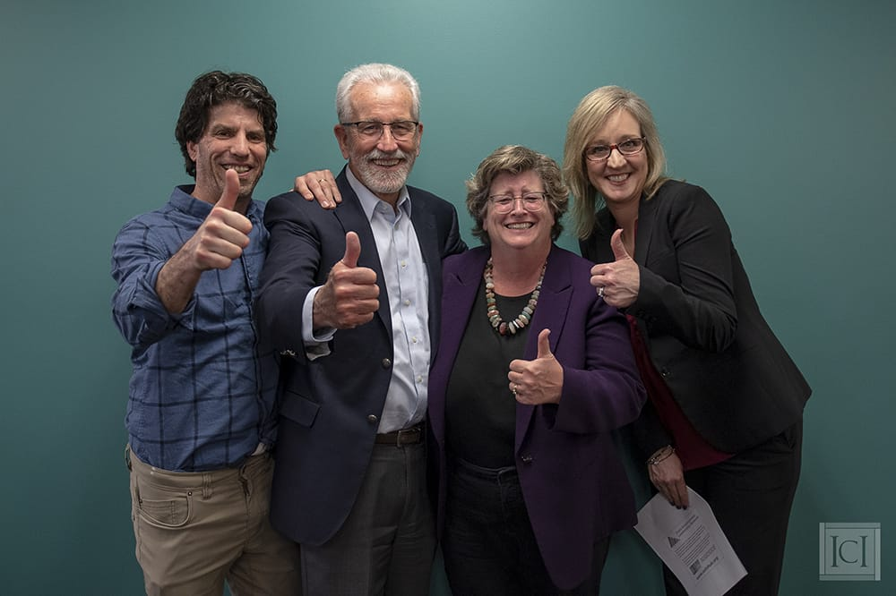

Farewell to Outgoing Dean Bill Kiernan!

Dr. William E. Kiernan recently celebrated his retirement from his role as dean of the School for Global Inclusion and Social Development, the UMass Boston graduate school where the ICI is housed.

Since he joined the staff at Boston Children’s Hospital in 1972, Bill has been a leader in the area of ensuring full rights and self-determination for people with disabilities. Bill became the director of the ICI in 1993, and held that position until 2017.

In the director role, Bill led our institute to become a national and international innovator around inclusion of people with disabilities in all areas of society, with a special focus on competitive employment in the community.

Throughout Bill’s career, he has been a beacon for justice and equity for all vulnerable and excluded populations, especially those with disabilities. We will miss him, and are grateful for his many years of leadership.

Watch our tribute video to Bill, below.

`video: https://icimedia.wistia.com/medias/lkf9y1ojnc`

`video: http://fast.wistia.net/embed/iframe/lkf9y1ojnc`

`youtube: d3kEOqkx5`
