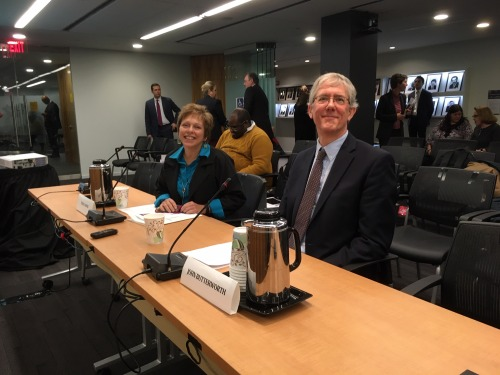

On November 15th, ICI senior researcher [John Butterworth](/about/staff-directory/john-butterworth) provided testimony on data regarding subminimum wages at the [U.S. Commission on Civil Rights](https://www.usccr.gov/) public briefing on the civil rights impact of subminimum wage on people with disabilities. You can [listen to an archive online](https://docreader.readspeaker.com/docreader/?jsmode=1&cid=btieo&lang=en_us&url=https%3A%2F%2Fwww.usccr.gov%2Fpress%2F2019%2F11-05-Agenda-Subminimum-Wages.pdf&referer=https%3A%2F%2Fwww.usccr.gov%2FArchives%2F&v=Google%20Inc.) or read his testimony below.

**Statement of John Butterworth, Ph.D.**  
Senior Research Fellow and Director of Employment Systems Change and Evaluation Institute for Community Inclusion  
University of Massachusetts Boston  
U.S. Commission on Civil Rights Hearing  
Subminimum Wages: Impacts on the Civil Rights of People with Disabilities
Panel Two: Data Regarding Subminimum Wages  

November 15, 2019

It is a pleasure to join you today and participate in the discussion of employment opportunities for individuals with disabilities.

I am a Senior Research Fellow and Director of Employment Systems Change and Evaluation at the Institute for Community Inclusion at the University of Massachusetts Boston. I have worked on expanding employment opportunities for individuals with disabilities for the past 40 years from multiple perspectives including providing direct supports, managing day and employment services for individuals with intellectual and developmental disabilities, training employment support and transition professionals, supporting community organizations to transform and refocus on employment and community life engagement, and supporting states to build employment policy and strategy. One element of that work has been a longitudinal study of trends in employment and day services and outcomes that is funded by the Administration for Community Living and informs policy and assess our progress in supporting high quality individual life outcomes.

The questions asked of this panel address the role of data in understanding worker’s participation in employment at less than minimum wage, and what we can learn from those data to support policy and practice. The larger context is how we understand both individual and policy priorities, and the substantial local and state to state differences that exist in employment participation and reliance on subminimum wage that support the goals of community life engagement and employment first.

Starting with the early days of the supported employment movement in the mid to late 1980s, there has been a vision that individual competitive integrated employment would become the preferred and usual outcome for individuals with disabilities who receive a day or employment service. Competitive integrated employment is defined in the Workforce Innovation and Opportunity Act of 2014, but at its simplest is a person working at an individual job in a local business, earning the prevailing wage for that position or industry, alongside peers who do not have disabilities. While we have struggled to bring that vision to scale, the convergence of individual advocacy, state investment in employment first, and strengthened federal policy has supported a return to growth in employment participation over the past 6 years.
