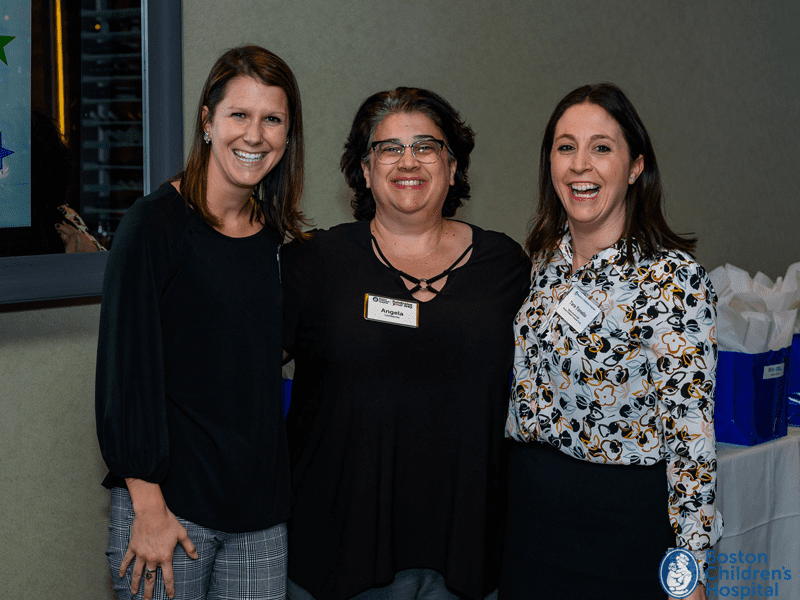

Boston Children’s Hospital Foundation held its first annual Special Events Award Reception, “A Night of the Stars.” At the ceremony ICI’s Angela Lombardo, [Down Syndrome Program](https://www.childrenshospital.org/centers-and-services/programs/a-_-e/down-syndrome-program) coordinator and  [LEND Boston](https://www.lendboston.org/) family faculty, received the Impact Award.

Lombardo was recognized for the way she goes above and beyond to significantly impact the lives of countless families, patients and siblings. She has organized a fashion and talent show for patients with Down Syndrome and their families, raising $5,000 in its first year and surpassing that amount in its second. She has an active role in multiple fundraising events including captaining a walk team at the Eversource Walk each June.

Lombardo maintains an active role in peer-to-peer programs, and inspires other families to raise funds for and get involved with the Down Syndrome Program. Lombardo has been the LEND Boston program’s family faculty for many years, coordinating family visits for all LEND fellows. These visits allow LEND fellows to visit a family in their home, learning about resiliency, family coping strategies, and family perspectives.

In recognition of her significant role in the Down Syndrome community, Lombardo was recently accepted as a board member of the [Down Syndrome Medical Interest Group Program](https://www.dsmig-usa.org/) (DSMIG-USA).  DSMIG-USA consists of health professionals who are dedicated to promoting the optimal health care and wellness of individuals with Down Syndrome across their entire lifespan.

We join with Boston Children’s Hospital to thank Lombardo for her years of service and to recognize her for her hard work!
