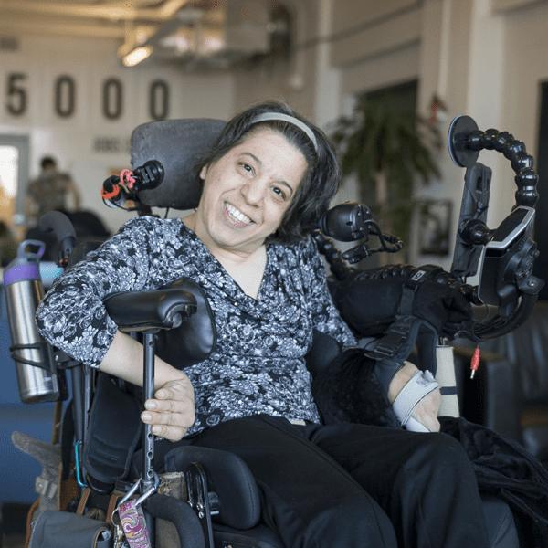

We would like to introduce you to the new  [Barbara Wilenski Gopen](https://www.mass.gov/service-details/barbara-wilensky-gopen-memorial-fellowship)  and  [Allen C. Crocker Family](https://www.mass.gov/doc/allen-c-crocker-family-fellowship/download)  Fellows!

**Adriana Mallozzi**, the Gopen Fellow, born with cerebral palsy (CP) has always been an innovator, finding ways to engage in activities creatively when challenges demanded it. Her project, Quirk LAABS: Leveraging Abilities to Access Better Solution, is envisioned to be an accessible, inclusive, and collaborative workspace for current and aspiring entrepreneurs with disabilities, as well as small businesses/organizations that work on solutions for the disability community.

**Asha Abdullahi**, the Crocker Fellow, was born in Somali and is the mother and brother of someone with a disability. She has worked for years to help educate her community about disabilities, coming from a country where people with disabilities are often not understood and can be highly stigmatizing to the family. She has developed a new nonprofit, [SPACE: Somali Parents Advocacy Center for Education](https://spacema.org/), that will set up support groups for Somali families and will help educate healthcare providers about Somali culture. Her work aims to assist families in finding services they need in developing family-centered planning that creates a vision for self-direction and working as a cultural broker for healthcare providers.

We would like to welcome Adrianna and Asha to the ICI!
