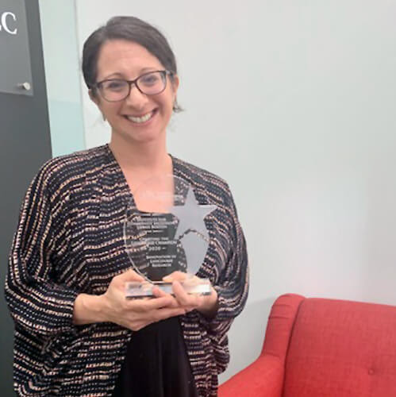

Congratulations to ICI’s Allison Cohen Hall! Allison was named the October 2020 Innovation Award Winner by Charting the LifeCourse Nexus located at the University of Missouri Kansas City.

Allison accepted this award on behalf of the research team that includes Jaimie Timmons, Jennifer Bose, and John Shepard. The research involved a

Facebook intervention with families of transition-aged youth that used Charting the LifeCourse (CtLC) materials. The research showed an impact on families’ attitudes, expectations and activities about transition planning.

[Read more about Allison and the award](https://www.lifecoursetools.com/events/showcase-2020/october-virtual-showcase-2020/).
