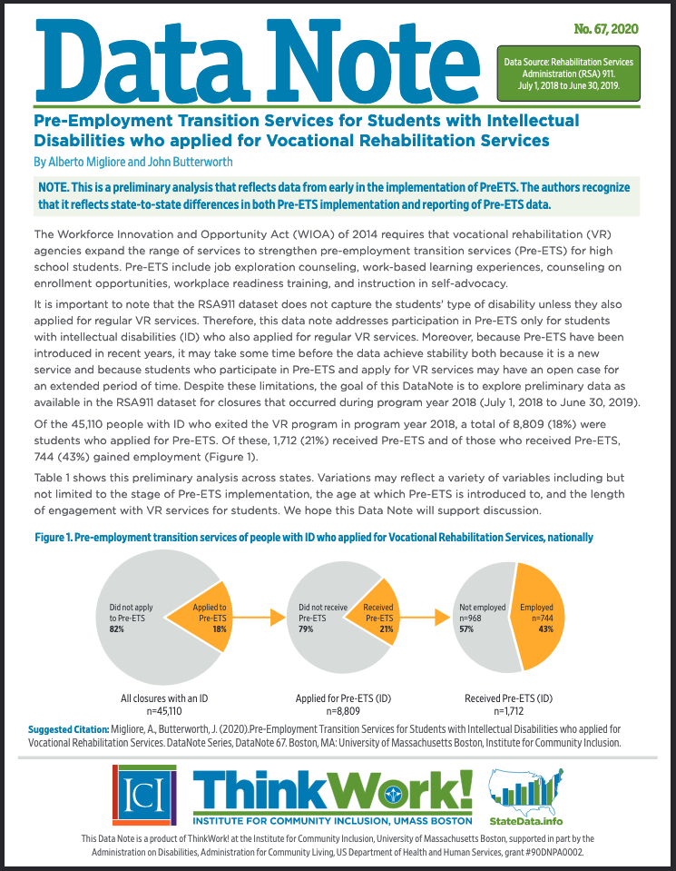

This [DataNote](https://scholarworks.umb.edu/cgi/viewcontent.cgi?article=1115&context=ici_pubs) looks at how many students with intellectual disabilities who applied for vocational rehabilitation (VR) services received pre-employment transition services (Pre-ETS) and their employment outcomes. Of the 45,110 people with intellectual disabilities who exited VR in 2019, a total of 8,809 were students who applied for Pre-ETS, of whom 1,712 received Pre-ETS and 744 gained employment. [Read the DataNote](https://scholarworks.umb.edu/cgi/viewcontent.cgi?article=1115&context=ici_pubs) to learn more about these findings nationally and by state.