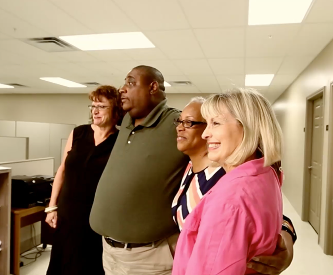

A special issue of the [Journal of Vocational Rehabilitation](https://content.iospress.com/journals/journal-of-vocational-rehabilitation/53/3) highlights the innovative work of researchers at the ICI and [Mathematica Policy Institute](https://www.mathematica.org/our-publications-and-findings/projects/substantial-gainful-activity-sga-project-demonstration) on the [Substantial Gainful Activity Project](https://www.explorevr.org/returntoworkssdi) (SGA Project).

The SGA Project, which is funded by the [Rehabilitation Services Administration](https://www2.ed.gov/about/offices/list/osers/rsa/index.html) (RSA), demonstrates how a new approach to vocational rehabilitation (VR) services has improved wages for VR customers who receive Social Security Disability Insurance (SSDI) benefits in Kentucky and Minnesota.

To be eligible for SSDI benefits, a person must be unable to engage in substantial gainful activity (SGA) which is defined as certain monthly earnings amount.

Once eligible, persons receiving SSDI qualify for work incentives including trial work periods. People who want to return to work often struggle to find the right combination of earnings, supports, and work incentives to gain economic independence.

The SGA Project sought to test a VR practice designed to advance economic independence of SSDI clients of VR. Key components of the rapid coordinated team approach were:

*   financial and benefits counseling,
*   job placement,
*   rapid engagement, and
*   a coordinated team.

Demonstration projects like this one highlight the importance of researcher-VR agency partnerships in uncovering promising practices for VR agencies to use with their clients.

To learn more about the project findings, [read the journal articles](https://content.iospress.com/journals/journal-of-vocational-rehabilitation/53/3) authored by several [ExploreVR](https://www.explorevr.org/returntoworkssdi) team members including: Nerlie Blackburn, Susan Foley, Kelly Haines, Joe Marrone, Linda Mock, Allison Taylor, and Russ Thelin.