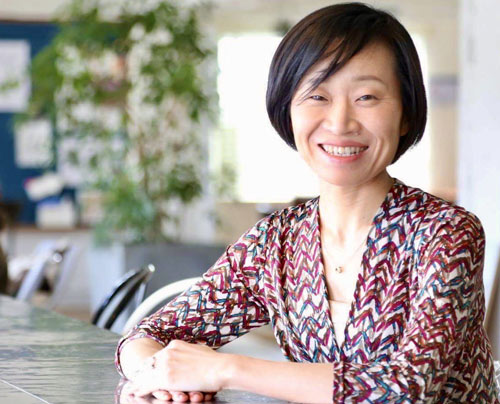
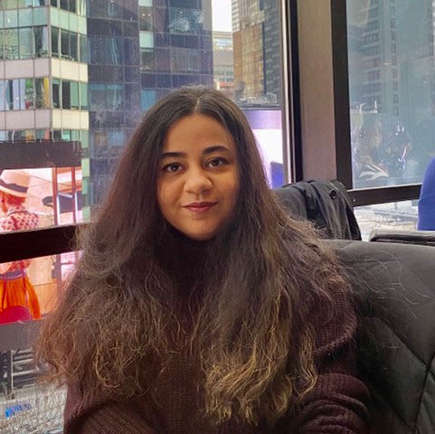
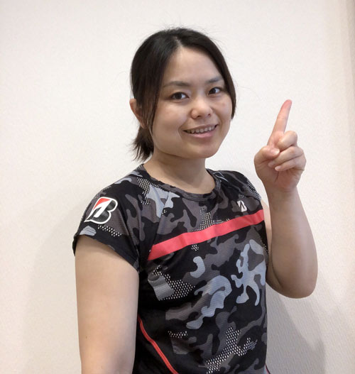
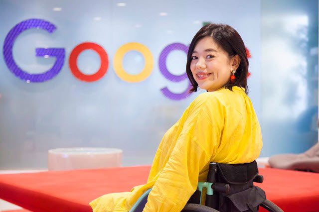
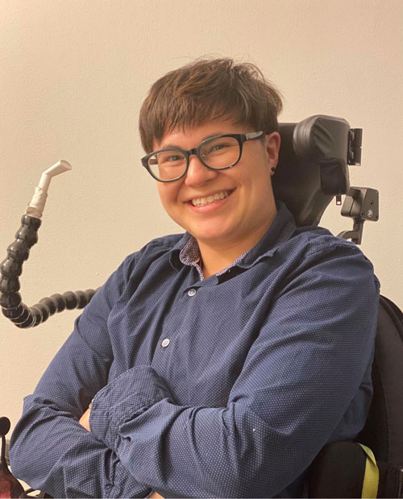

The ICI is pleased to offer the U.S. — Japan Business Leadership Institute on Youth Disability Employment Webinar Series! The first webinar, _How Do We Access Employment? Japanese and American College Students and Young Professionals with Disabilities Share Barriers and Break-Throughs_, will be on February 18th from 7–8:30pm ET.

Panelists will discuss the types of barriers that they have faced as college students or professionals with disabilities and share how their experiences have shaped their lives and those of other individuals in their communities. Panelists will also share their thoughts about why such barriers exist (history of barriers) and illustrate how they overcame them (ways to move forward). The goal of this panel is to demonstrate that the problematic aspects of disability employment cannot be fixed by adjusting hiring procedure alone. To enable youth with disabilities to pursue employment, we must resolve barriers in adjacent social spheres (i.e. In education and built environment).

The webinars are free and open to public. [Registration is required](https://communityinclusion.zoom.us/webinar/register/WN_nrOJsIsfSF-9yexfXYKZdg).

## Meet the players:

 

### Moderator: Emi Aizawa
**_Global Partnerships Lead, Business Development Department, Mirairo Inc._**

Emi Aizawa works as Global Partnerships Lead in the business development department at Mirairo Incorporated in Tokyo, Japan. The company provides research, training, and consultation on universal design and barrier-free access to a wide range of stakeholders in Japan and internationally. At Mirairo, Emi specifically works to expand the company’s global reach and explore new business opportunities. Before joining Mirairo in 2016, Emi worked for more than 20 year for the Japan International Cooperation Agency (JICA), the Japanese government agency responsible for the delivery of international development assistance. At JICA, Emi focused on planning and implementing technical cooperation projects to facilitate and increase social participation of persons with disabilities in developing countries, including Cambodia, Thailand, and Paraguay. She was instrumental in mainstreaming disability in JICA projects. Emi has a Master’s degree in Disability and Development from the University of Leeds, United Kingdom.

## Panelists:

### Anu Sawhney

**_Disability Community Organizer & Freelance Writer_**

Anu Sawhney is a recent college graduate who works at the Boston Center for Independent Living, which is a disability rights non-profit organization in Boston, Massachusetts. Anu is also a board member at DREAM (Disability, Rights, Education, Advocacy, Mentoring), a national organization for and by college students with disabilities housed at the National Center for College Students with Disabilities (NCCSD). Her work as a board member is focused on organizing students to fight systemic issues of ableism and racism in higher education. Anu graduated from Boston University in the summer of 2020 with a Bachelor’s degree in Political Science and Philosophy. As a community organizer who is passionate about disability justice and mutual aid. Anu hopes to pursue these interests in her graduate study next fall. When Anu is not working or studying, she occasionally freelances as a reporter and writer. She enjoys reading and baking during the cold New England winters.

### Rie Ogura

**_Para Badminton Athlete, Bridgestone Corporation_**

Rie Ogura works in the Research & Development Transformation Promotion Department at Bridgestone Corporation in Tokyo, Japan. She is also a Bridgestone-sponsored Paralympian training to compete in para badminton in the 2021 Paralympic Games in Tokyo. Born and raised in Saitama prefecture in Japan, Rie graduated with a degree in engineering from university and then worked for several Japanese manufacturing companies. Rie begun using a wheelchair when she was 20 years old because of AMC (Arthrogryposis Multiplex Congenital). Three year later, she started playing para badminton and has been competing nationally and internationally. When she is not working or competing, Rie enjoys spending time with her husband and two children.

### Mizuki Hsu

**_Community Inclusion Advisor, Google Japan_**

Mizuki Hsu works as a Community Inclusion Advisor at Google Japan in Tokyo. Born and raised in Japan, Mizuki moved to the United States after high school where she pursued and graduated with a Bachelor’s degree in Communication Studies and International Studies from the University of Wisconsin River Falls. After returning to Japan, Mizuki gained work experience at various companies in Tokyo and also volunteered at a non-profit that publishes a magazine for women with disabilities. Driven by her passion to promote equal employment opportunities for people with disabilities in Japan and internationally, Mizuki won a prestigious fellowship from the Duskin AINOWA Foundation that allowed her to conduct research on disability and employment issues at the Burton Blatt Institute, Syracuse University in New York. During her one-year fellowship, Mizuki traveled to 10 U.S. states interviewing more than 100 people about effective strategies and practices to maximize disability inclusion in the workplace. Mizuki is a working mother of two daughters. She lost her ability to walk when she was 2 years old and begun using a wheelchair when she was 7 years old.

### Noah Ohashi

**_Community Organizer_**

Noah Ohashi is a graduate student at the University of Illinois at Chicago (UIC) in the department of Disability and Human Development. Noah works as a Disability Community Organizer for two organizations in Chicago, Illinois: Chicago ADAPT, a disability rights organization, and Connecting Dots International, a diverse student organization at UIC. Noah was born with a neurodiverse disability in Fukushima prefecture in Japan. He graduated from public high school and then moved to the United States to pursue a career as a professional Judo player. However, due to his progressive muscular dystrophy, Noah had to return to Japan, where he lived in various residential hospitals and institutions for people with disabilities. During the March 11, 2011 earthquake off the Pacific coast of Tōhoku, Noah evacuated to Osaka, where he found a new community with the people from the Independent Living Center “MUCHU.” He joined the center and has since been managing their advocacy team. Around the same time, Noah also started work as the director and commentator for the “Barrier-Free Variety Show,” a national educational TV show in Japan that is produced by people with disabilities for people with disabilities. Noah returned to the United States in August 2020 to pursue graduate studies at UIC.

We will provide the following accommodations for each webinar:

- English and Japanese interpretation
- English and Japanese Live captions (CART)
- American sign language and Japanese sign language

Please contact Heike Boeltzig-Brown ([heike.boeltzig@umb.edu](mailto:heike.boeltzig@umb.edu)) if you need additional accessibility accommodations to fully participate in this webinar series.