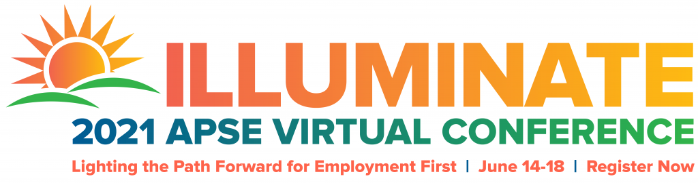

Numerous ICI staffers are scheduled to present during the 2021 APSE Virtual Conference. The conference, titled “Lighting the Path Forward for Employment First,” will run from June 14–18.

 

**_Monday, June 14:_**

**Sheila Fesko**  and  **Karen Flippo**  will present at 3:45pm ET. Their session, “Developing Staff Competencies: New Training Approaches for Employment Support Professionals,” will consider the critical components of staff professional development, the role of credentialing and certification, and remote strategies to support the continued expansion of community-based employment. Their session will address the following questions:

-   How do you apply the APSE Universal Competencies in staff development?
-   What are the differences between credentialing, accrediting, and certifying professional development, and how does that inform our decision making?
-   How can online training support a consistent baseline of knowledge for all staff, and address the varied schedules of employment professionals?

**_Tuesday, June 15:_**

At 2:30pm ET,  **Brit Miles**  and  **Lara Enein** are leading the session, “Work-Related Experiences: Legal and Practical Guidelines.” Volunteer work, internships, and unpaid job exploration can be effective strategies for individuals with disabilities looking to gain work-related experience, as can assessments and on-the-job training. However, such activities must be undertaken carefully, with a clear understanding of the purpose of these activities. Brit and Lara will discuss what is permitted from a legal perspective, as well as practical considerations regarding the appropriate use of volunteer and unpaid work experiences.

**_Wednesday, June 16:_**

At 2:30pm ET,  **David Hoff**  and  **Jessica Keenoy**  will discuss how the use of readily available assistive technology (AT) has emerged as an important tool in self-management, virtual, and remote employment supports. During their session, “Employment First Meets Technology First: It’s More Than Just The Device,” attendees will learn how the Missouri Technology First initiative has been integrated within the state’s Employment First efforts, and is building AT competency among service providers, front line staff, and individuals with disabilities.

At 3:45pm ET,  **Alberto Migliore** and outside electronic documentation software experts will present, “Leveraging Electronic Documentation Software to Improve Employment Outcomes. A Panel Discussion.” Many people and organizations use electronic documentation software for automating billing and compliance reporting. However, this software can do more than that. During this session, Alberto and a panel software vendors will explain how to leverage this technology for tracking metrics that matter and improve program effectiveness in working with job seekers.

**_Thursday, June 17:_**

**Jean Winsor**,  **Jaimie Timmons**,  **Jennifer Sulewksi**, and  **Jennifer Bose**  will join Julie Christensen of National APSE during their 1:15pm ET session, “Moving Forward After COVID-19: Results From the APSE Survey on the Impact of COVID-19 on Employment Services and Outcomes.” In 2020 and 2021, employment and day service providers responded to three rounds of APSE surveys on the impact of COVID-19 on disability employment services and outcomes. ICI staffers, in collaboration with APSE leadership, analyzed the results of the surveys. During this session, they will share the results of this analysis, offer recommendations to assist providers recovering from the pandemic, and continue to enhance their employment services.

At 3:45pm ET,  **Jaimie Timmons**  and  **John Butterworth**  are presenting “COVID-19 and Employment Supports: What Have We Learned” with their colleague Danielle Mahoehney from the  Institute on Community Integration, University of Minnesota. They will explore what we have learned from employment consultants who provided supports in this unprecedented time, and what implications their innovations have for employment support in the future.

**Registration is now closed.**
