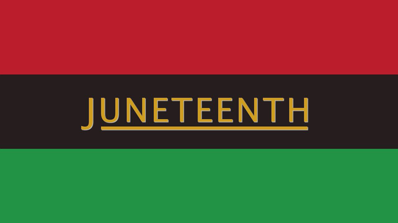

**What is Juneteenth?**

Juneteenth commemorates the day that enslaved people in Texas learned that slavery was outlawed. On June 19, 1865, the Union Army general, Gordon Granger, announced  [General Order №3](https://en.wikipedia.org/wiki/General_Order_No._3)  in Galveston, Texas which proclaimed freedom from slavery.

**But wait — didn’t slavery end in 1863 with the Emancipation Proclamation?**

Although slavery was first outlawed in confederate states by the Emancipation Proclamation in January 1863, slavery did not end for everyone immediately. There are several reasons for this.

In 1863, the Civil War  was still going on. A primary purpose of the Emancipation Proclamation was expediency — the union states needed soldiers to win the war. The Emancipation Proclamation announced that Black men could join the Union Army and Navy forces.

President Lincoln sent union troops to enforce the Emancipation Proclamation, but it took a long time to spread the word. There were very few union troops in Texas, and therefore, very few troops to enforce the Emancipation Proclamation.

Many white slaveowners knew this. They did not want slavery to end. They moved to Texas knowing that slavery could continue as long as union troops did not enforce the law. White slaveowners in Texas did not tell enslaved people that slavery was outlawed.

Though white Texas lawmakers were aware of the Proclamation in 1863, they did not share this news widely. It was not until 1865, when Robert E Lee resigned, that union general Granger rode to Texas to enforce the Proclamation. At that time, 250,000 Black people were still enslaved in Texas.

Furthermore, the Emancipation Proclamation only applied to confederate states, which were states that rebelled against the union. It did not apply to border states that were loyal to the union. Many confederate states simply ignored the Proclamation. Slavery continued in border states like Delaware and Kentucky until December 1865, despite the Emancipation Proclamation. It was not until the 13th amendment was ratified that slavery officially ended on December 6, 1865.

Even then, slavery did not end peacefully. Many Black people in America were not free in 1865. Black people in America emancipated themselves, but not without tremendous strength and struggle.

**Who celebrates Juneteenth?**

Many African American people in the US have been celebrating Juneteenth since its first anniversary in 1866. In Texas, the first celebration was named Jubilee Day.

Traditionally, Juneteenth is a time for celebration, education, and sharing resources. In many of the early years during Reconstruction, freed people taught each other about voting and other rights. In 1867, Black leaders in Texas pooled funds to purchase land for Juneteenth celebrations, the first of which is known today as  [Emancipation Park](https://en.wikipedia.org/wiki/Emancipation_Park_(Houston))  in Houston.

Over time, as Black people from Texas moved to other parts of the US, Juneteenth celebrations proliferated. People celebrate Juneteenth today with barbecue, soul food, picnics, street fairs, parades, stories, family gatherings, and more. Many people consider Juneteenth the real independence day.

**Why are so many people just learning about Juneteenth for the first time?**

Juneteenth celebrations ebbed and flowed throughout the years in different parts of the country during Reconstruction, Jim Crow, and the Civil Rights Movements in the 1960s. Many people are learning about Juneteenth for the first time because of mainstream television (notably, TV shows  _Black-ish_  and  _Atlanta_) and social media.

Juneteenth is finally being recognized officially by states and cities across the US. Texas was the first state to make Juneteenth an official state holiday in 1980, over 100 years after its inception. By 2019, 47 states and DC recognized Juneteenth as a holiday, but only three states recognized Juneteenth as an official state holiday.

In 2020, UMass Amherst history professor of Africana studies,  [Amilcar Shabazz](https://www.umass.edu/afroam/member/amilcar-shabazz), called on Massachusetts lawmakers to propose a bill making Juneteenth an official state holiday. Massachusetts now recognizes Juneteenth Independence Day as an official state holiday.

On Juneteenth 2020, UMass Boston’s Interim Chancellor Kathrine Newman shared a statement about Juneteenth: “_Juneteenth is a holiday to celebrate identity, purpose, and the public manifestation of freedom. … [Universities are] spaces where ideas can become plans, where dreams can become actions, and social change can become a new and meaningful commitment.”_

Juneteenth is still not an official US holiday, but many groups led by Black women have organized to bring Juneteenth to official national recognition:

·  [Opal Lee](https://www.opalswalk2dc.com/), who walks from Fort Worth, TX to Washington DC each June;  [National Juneteenth Observance Foundation](http://nationaljuneteenth.com/);  [Unity Unlimited](https://www.unityunlimited.org/home.html)

·  [Lula Briggs Galloway](https://www.mlive.com/news/saginaw/2008/11/preserver_of_saginaws_black_hi.html), National Association of Juneteenth Lineage, founder of the Juneteenth Creative Cultural Center and Museum in Saginaw, MI; author the book, Juneteenth: Ring the Bell of Freedom

·  [Clara Peoples](https://en.wikipedia.org/wiki/Juneteenth_in_Oregon#Clara_Peoples) , “Mother of Juneteenth”, who brought Juneteenth to Oregon

**Learn more about Juneteenth and other resources:**

· [Juneteenth and the Black Women of the Abolitionist Movement](https://womensmuseum.wordpress.com/2020/06/19/juneteenth-and-the-black-women-of-the-abolitionist-movement-a-brief-history/)

· [Juneteenth and Women’s History ](https://womenatthecenter.nyhistory.org/juneteenth-and-womens-history/)

· [The Root: This Is Why Juneteenth Is Important for America](https://www.youtube.com/watch?v=iu6ntwHws5g)

· [Juneteenth History](https://juneteenth.com/)

·  [https://www.youtube.com/watch?v=XLHRh8epFdU](https://www.youtube.com/watch?v=XLHRh8epFdU)

·  [Emancipation Proclamation](https://www.archives.gov/exhibits/featured-documents/emancipation-proclamation)

· [Celebrating Juneteenth](https://www.teenvogue.com/story/juneteenth-celebration-meaning-explainer)

· [Juneteenth Overview](https://en.wikipedia.org/wiki/Juneteenth#CITEREFKnight2011)

· [Juneteenth in Massachusetts](https://www.masslive.com/politics/2020/06/make-it-a-federal-holiday-make-it-meaningful-says-umass-professor-who-sparked-bill-to-make-juneteenth-an-official-holiday-in-massachusetts.html)

· [UMass Boston’s Interim Chancellor’s Statement](https://www.facebook.com/umassboston/videos/271535137238100/)

