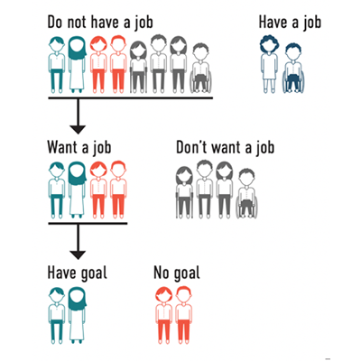

**How have advocacy efforts and policy changes in the last 30 years impacted people with intellectual and developmental disabilities in our communities?**

> “People with disabilities deserve to live in the community without being segregated. When we are included, people see what we have to offer.” _— Max Barrows_

As we reflect on the 31st anniversary of the Americans with Disabilities Act (ADA), the Institute for Community Inclusion’s (ICI) [StateData.info](https://www.thinkwork.org/statedatainfo) team and partners published the digital historical account, [_30 Years of Community Living for Individuals with Intellectual and/or Developmental Disabilities_](https://acl.gov/30years).

The book is a partnership of [ICI’s StateData.info](https://www.thinkwork.org/statedatainfo), the [Institute on Community Integration at University of Minnesota](https://communityinclusion.tumblr.com/post/657432252500885504/30-years-of-community-inclusion-for-people-with#:%20https://ici.umn.edu/), and [University of Colorado at the Anschutz Medical Campus](https://www.cuanschutz.edu/). ICI’s work focuses on expanding employment opportunities, while the other partners address where people live, public spending on services, and the role of technology. The goal of the book is to inform policy makers, legislators, service providers, and communities. The 30-year report uses data from three longitudinal data projects funded under the [ACL’s Projects of National Significance program](https://acl.gov/programs/strengthening-aging-and-disability-networks/projects-national-significance) to illustrate the opportunities and challenges people with IDD experience.

30 Years of Community Living explores the history of the community inclusion movement from 1987–2017 in the US. Activists and advocates with disabilities have worked tirelessly to persuade policy makers to improve community supports and employment opportunities.

This advocacy has led to many improvements for our communities, though challenges remain:

*   Between 1967 and 2017, the number of people with IDD living in state-run institutions dropped by 90%, from 194,650 people to 18,807 people. Over 80% of people with IDD moved from institutions to homes in their communities between 1987–2017.
*   Between 1990 and 2017, the number of people with IDD who receive integrated employment services grew from a few thousand to over 130,000\. Though integrated employment for people with IDD has increased, in 2017, only 1 in 5 people with IDD worked in the community. Even fewer (1 in 6) had a job working for a local business, earning a regular wage alongside coworkers who do not have disabilities (i.e., competitive, integrated employment).
*   Allocating money for technology supports community engagement for people with IDD. Heidi Myhre shared, “My friend has a cell phone. Why can’t I have one? Technology, and the help of others, can help me become more independent.” In 2017, spending on technology was far less than 1% of overall spending on IDD supports and services.

Though people with IDD have been living and working in our communities for decades, there are still barriers to their full participation and community integration. People with IDD are regularly denied basic freedoms and choices, [particularly if they have intersecting marginalized identities](https://www.statedata.info/sites/statedata.info/files/files/trends_2017_F2b.pdf).

Today, almost half of people with IDD who do not have a job in the community say they want one, but only 40% of the people who want a job say they have a goal in their individualized service plan.

What will the next 30 years bring? ACL grantees will continue to collect data and analyze trends to help us understand the impacts of policies, initiatives, and advocacy on the communities we belong to and serve.

Read the full report, [_30 Years of Community Living for Individuals with Intellectual and/or Developmental Disabilities_](https://acl.gov/sites/default/files/Aging%20and%20Disability%20in%20America/PNS_Book_FINAL_07-12-21.pdf).