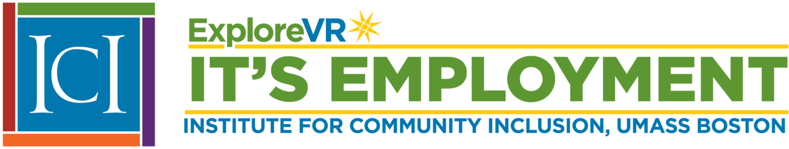
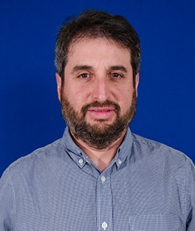
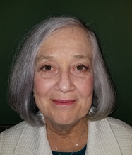
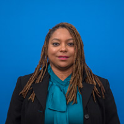

ICI IT’S EMPLOYMENT staff work with a highly engaged **technical expert panel** featuring a cross-section of experts in VR and services for individuals with ID, including self-advocates, to develop an array of project materials to support and supplement training course content.

This year, IT’S EMPLOYMENT launched its first online **Summer Intensive Course** to assist VR professionals in learning how to meet the needs of job seekers with ID and improve their employment outcomes. VR professionals participate in learning modules including, among others:

· Competitive Integrated Employment: Establishing Expectations

· Cultural Humility and Family Engagement

· Business Engagement Practices and the Dual-Customer Approach

IT’S EMPLOYMENT also hosts a **training series** and an annual **academic course**. In the training series, VR professionals can complete 2-hour course modules for Certified Rehabilitation Counselor (CRC) credit. Training modules are asynchronous and may be used for independent learning or as part of peer learning.

VR professionals can take the full semester **academic course** for graduate credit. This course helps VR professionals understand how to improve employment outcomes for job seekers with intellectual disabilities.

Additionally, IT’S EMPLOYMENT coordinates yearlong state **learning collaboratives** with VR agencies in Colorado and Vermont about VR services for individuals with ID. Project staff select two new states to participate each year. These state learning collaboratives include a community of practice and two days of in-person training for a cross-section of VR agency personnel and partners.

IT’S EMPLOYMENT staff include:

 

 

 

 

 

 

 

 

 

 

