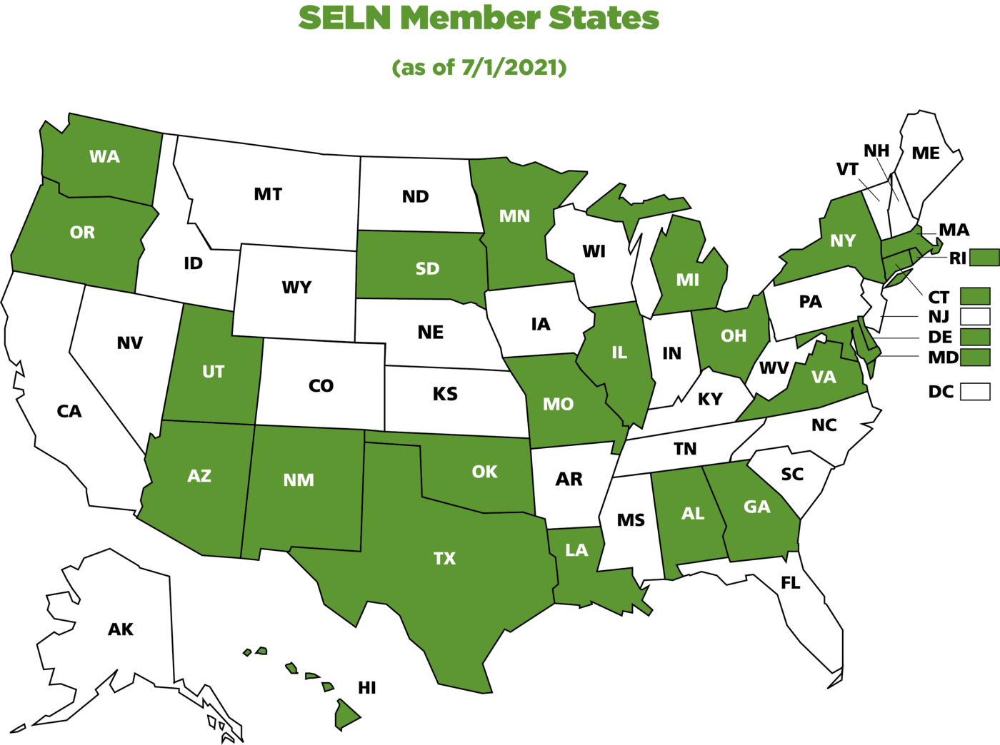

July 2021 signals the start of the State Employment Leadership Network (SELN) membership year 16!

Founded in 2006, this collaborative effort is jointly managed by the [ICI](http://www.communityinclusion.org/) and the [National Association of State Directors of Developmental Disabilities Services](https://www.nasddds.org/) (NASDDDS). Currently, 24 state intellectual and developmental disabilities (IDD) agencies have committed to improving integrated employment outcomes for the 2021–2022 membership year. These IDD agencies will explore common strategic themes through state-specific technical assistance and network-wide discussions.

As state IDD agencies strengthen their strategic integrated employment activities, states will have more opportunities for improved outcomes.

Learn more: [www.selnhub.org](http://www.selnhub.org/)