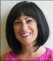
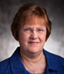

The Transformational Rehabilitation Leadership Training (TRLT) is a training program for current and aspiring leaders in vocational rehabilitation (VR). The goal of the TRLT is leadership enhancement that results in inclusive, career-oriented employment services for people with disabilities. The TRLT focuses on leadership development by addressing organizational and cultural conditions for VR counseling and related professionals.

The ICI co-created the TRLT program and accompanying certification with the University of Wisconsin-Stout Vocational Rehabilitation Institute (SVRI) and the Commission on Rehabilitation Counselor Certification (CRCC).

This November, the TRLT will launch its first online training cohort. The training program includes:

*   asynchronous online lessons covering six domains of leadership
*   monthly virtual communities of practice for cohort discussions on curriculum content between participants, training mentors, and VR leaders
*   an applied experiential learning capstone project to implement transformational leadership skills
*   three learning collaboratives to guide the planning, implementation, analysis, and presentation of the capstone project
*   ongoing consultation, guidance, advice, coaching, and mentoring from experienced VR professionals

After successfully completing the training program and capstone project, leaders can earn a nationally recognized Certified Rehabilitation Leader (CRL) credential from the CRCC.

TRLT leadership curriculum covers six core leadership domains:

1.  **Purpose-driven:** What is your organizational purpose, brand, culture, and values?
2.  **Conscious:** How do you consciously lead an organization? How can you consciously lead yourself and your staff?
3.  **Cultural:** How can you build community in your organization? What are your organization’s shared beliefs?
4.  **Creative:** How can you be comfortable with risks? How can you unleash organizational creativity?
5.  **Inspirational:** How can you foster commitment in your organization through story telling? How can you enlist others in a cause?
6.  **Collaborative:** How can you build trust with stakeholders, partners, and staff? How can you promote democratic, participatory leadership?

The TRLT covers leadership domains across three semesters, with two domains in each semester and four courses in each domain. Participants can complete lessons asynchronously, with guidance from TRLT instructor mentorship and peer-to-peer community discussions.

One learning collaborative session culminates the end of each semester. Each learning collaborative helps translate curriculum concepts into application for the design, implementation, and reporting for leadership capstone projects.

The TRLT began with discussions between CRCC and ICI staff about enhancing skills and capacities for VR agency leadership to support and advance professionalization of rehabilitation counseling for optimal services provision. CRCC, ICI, and SVRI subsequently partnered to develop this leadership enhancement training curriculum and program, and its accompanying Certified Rehabilitation Leader (CRL) credential, specifically for organizational leadership in VR settings.

TRLT organizers include:

 

**Kyle Walker, Executive Director, SVRI**

 

**Pam Shlemon, Executive Director, CRCC**

**Russ Thelin, Senior Policy Fellow, ICI**

**Dr. Susan Zahn, Director of Education and Training, CRCC**

Contact Russ Thelin at [Russell.Thelin@umb.edu](Russell.Thelin@umb.edu) for more about the Transformational Rehabilitation Leadership Training and the ICI’s partnership with SVRI and CRCC! Check out the [National Training Center for Transformational Rehabilitation Leadership](https://www.uwstout.edu/SVRI/CertifiedRehabilitationLeader) and our [TRLT factsheet](https://liveuwstout.sharepoint.com/sites/2034/Training/Shared%20Documents/Forms/AllItems.aspx?id=%2Fsites%2F2034%2FTraining%2FShared%20Documents%2FTransformationalLeadership%2FNTC%5Ffactsheet%5FFinal%2Epdf&parent=%2Fsites%2F2034%2FTraining%2FShared%20Documents%2FTransformationalLeadership&p=true&originalPath=aHR0cHM6Ly9saXZldXdzdG91dC5zaGFyZXBvaW50LmNvbS86Yjovcy8yMDM0L1RyYWluaW5nL0VWUC1kS0JzQ1BkRGdfc1NnenpHUGxZQkNfZ0FEN1RLV0ltVUV5NDN6TW90Y2c_cnRpbWU9d2VXaEtTaVAyVWc) to learn about this innovative program and to participate.
