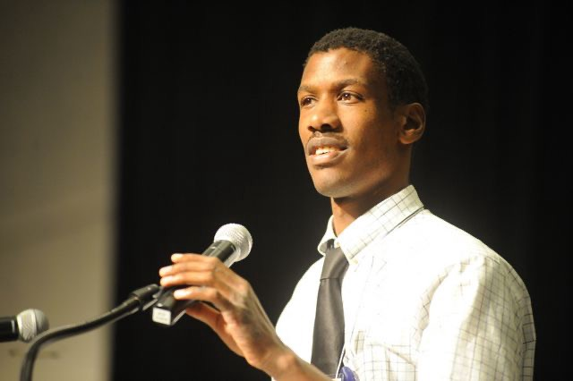

Employment is more than just work. For many people with and without disabilities, employment is about dignity, respect, independence, and inclusion.

The ICI advocates for the full inclusion of people with disabilities into the mainstream workforce. We conduct research and track state and national data trends in employment services and outcomes to inform our advocacy, services, training, and mentorship work.

At the ICI, we believe:

*   people with disabilities should be able to make informed choices about employment
*   achieving inclusive employment involves systems-level and organizational change efforts that address the intersections of disability and race, gender, sexual orientation, nationality, and other cultural identities
*   inclusive public policies can improve employment opportunities for people with disabilities
*   community participatory research can inform innovative & inclusive employment practices
*   knowledge translation can help move our employment research into practice
*   working with individuals with disabilities, families, educators, employment support providers, employers, and communities can help enhance transition services to prepare youth with disabilities to succeed in employment as adults

**What does it mean to make informed choices about employment?**

> _“Presume competence. And what we mean by presuming competence is when you meet a person with a disability you assume they are capable. Don’t assume that someone can or can’t do things but make sure they tell you what they need for accommodations and give them the chance to be in the driver’s seat.” –Max Barrows, Green Mountain Self-Advocates_

 

**Informed choice** is an important part of employment. Informed choice is the process of making decisions based on accurate information, knowledge, and experiences. The privilege of choice involves the privileges of making mistakes and learning from our experiences. Too often people with disabilities are not afforded the privilege of choice. This is particularly true for people with disabilities from historically marginalized communities.

You can learn more about informed choice and employment from our Tools for Inclusion, Issue 31, [Employment and Employment Supports: A Guide to Ensuring Informed Choice for Individuals with Disabilities](/pdf/TO31_F_R.pdf) by David Hoff and Nicholas Holz.

**How can we address racial and gender inequities in employment for people with disabilities on a systems-level?**

ICI’s ThinkWork published a report, [Employment and Economic Outcomes by Race, Ethnicity, and Gender for Individuals with and without Disabilities](https://www.thinkwork.org/sites/default/files/files/trends_2017_F2b.pdf), which includes data about racial and gender disparities and inequities in employment among people with disabilities.

Adults with disabilities are employed less than half as often as adults without disabilities. People of color with disabilities face additional employment, wage, and vocational rehabilitation (VR) service inequities and disparities compared to white people with disabilities.

White people with intellectual and developmental disabilities (IDD) are more likely to receive VR services that people of color with IDD. Most people with IDD who exited VR are male, white, and transition-age young adults.

Women with cognitive disabilities earn 28% less in wages than men with cognitive disabilities, even though they have similar working hours and employment rates. Though Black people with disabilities and Native American people with disabilities work the same number of hours as white people with disabilities, Black people with disabilities earn 22% less in wages than white people with disabilities, and Native American people with disabilities earn 18% less than white people with disabilities.

These racial and gender disparities in VR outcomes have remained steady since 2010.

The Center for American Progress published several reports about how to address systematic inequality in the US workforce. Particularly in the tipped workforce like the food service industry, historically marginalized workers experience systematic economic disadvantages:

> _“When workers depend on tips for almost three-quarters of their income, the consequence is that customers’ whims can effectively control tipped workers’ earnings and livelihood. This power imbalance leaves women, workers of color, disabled workers, and other historically marginalized workers particularly vulnerable to economic precarity and other injustices in these jobs.” (from the Center for American Progress report,_ [_Ending the Tipped Minimum Wage Will Reduce Poverty and Inequality_](https://www.americanprogress.org/issues/poverty/reports/2021/03/30/497673/ending-tipped-minimum-wage-will-reduce-poverty-inequality/)_)_

Also, check out the Center for American Progress report, [Systematic Inequality and Economic Opportunity](https://www.americanprogress.org/issues/race/reports/2019/08/07/472910/systematic-inequality-economic-opportunity/) for more suggestions about how to address employment inequities on a systems-level.

**How has the COVID-19 pandemic changed employment for people with disabilities?**

The COVID-19 pandemic has changed how people with and without disabilities approach employment. ICI published [Working During the COVID-19 Pandemic: A Guide for Informed Decision-Making](https://covid19.communityinclusion.org/pdf/TO33_COVID_F.pdf), which includes additional factors to consider when making decisions about working during the pandemic. Check out [ICI’s COVID-19 resource page](https://covid19.communityinclusion.org/) for more employment resources for people with disabilities, service providers, and communities during the COVID-19 pandemic.

**This October, learn more about Disability and Employment**

The ICI has many publications and resources about employment and disability. Here are a few resources to help you learn more about employment during Disability Employment Month:

*   [StateData: The National Report on Employment Services and Outcomes Through 2018](https://www.thinkwork.org/sites/default/files/files/state_data_2021_F%5B3%5D.pdf), by Jean Winsor, Jaimie Timmons, John Butterworth, Alberto Migliore, Daria Domin, Agnes Zalewska, & John Shepard
*   [Data Note: State Intellectual and Developmental Disability Agencies’ Service Trends](https://scholarworks.umb.edu/cgi/viewcontent.cgi?article=1089&context=thinkwork), by Agnieszka Zalewska & Jean Winsor
*   [Bringing Employment First to Scale: Pushing the Integrated Employment Agenda: A Case Study of Oklahoma’s High-Performing Employment System](https://www.thinkwork.org/sites/default/files/files/OK%20RRTC%20brief%20ISSUE22_F.pdf), key findings from the Rehabilitation Research and Training Center on Advancing Employment for Individuals with Intellectual and Developmental Disabilities, by Jean Winsor, Cady Landa, Allison Hall, & Caro Narby
*   [Fact Sheet: Rural Youth Apprenticeship Development Project](https://www.explorevr.org/sites/explorevr.org/files/files/RYAD_fact%20sheet4%20(2).pdf), by DeBrittany Mitchell
*   [Get the Facts on Transition to Employment](https://employmentfirstma.org/files/getfacts_1_F.pdf), by Massachusetts Partnership for Transition to Employment
*   [IT’S EMPLOYMENT kicks off its training series for vocational rehabilitation professionals](https://communityinclusion.medium.com/?p=e04a64305904) to improve employment outcomes for job seekers with intellectual disabilities