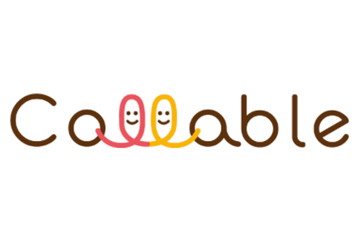

[Collable](https://collable.org/) is a non-profit organization based in Tokyo, Japan. Collable plans and hosts inclusive design workshops and promotes inclusive design in their work. In 2020, Collable started a study program for students with diverse disabilities to learn about and explore work and career options through workshops and networking events, online learning resources, company tours, and internships. In line with the organization’s slogan “Everyone become a creator for society,” Collable strives to foster spaces and environments collaboratively: not just for people with disabilities, but with people with and without disabilities to enjoy learning and experiencing community together.

As a mini-grant awardee, Collable proposed to design and implement a virtual internship program for college students with disabilities to encourage students to think about their future and to start exploring possible career pathways. A Collable project staff explained,

> “Many college students with disabilities have difficulty imagining what their lives will be like once they graduate. This is partly because they have little information, knowledge, experience, or role models showing how someone with a disability can work for a company. In Japan, colleges provide support to students with disabilities at their own discretion, and often students do not have the opportunity to negotiate with the college about this support.”

Collable’s internship program will have three phases. In the first phase, students participate in a workshop to deepen their understanding of disability and disability identity, to learn how to express themselves, and to learn how to advocate for their needs.

The first phase also introduces students to “[Gathering](https://www.youtube.com/channel/UCUWJ6UBcDkwjKto-S4mAIeg).” Gathering is Collable’s successful YouTube channel that features short video clips addressing topics like identifying one’s strength and weaknesses in the context of job hunting, dealing with job hunting anxiety, disability self-disclosure and communication in the workplace, positively embracing change, and more. Several of these videos feature employees with disabilities who can serve as role models for young people with disabilities. Collable encourages students to watch these videos and apply what they learn to their emerging career pathway plans.

In the second phase, students have an opportunity to tour one or more companies to job shadow and interact with employees at those companies. At the end of the program, students meet with Collable staff to collectively reflect on their program experience, talk about lessons learned, and discuss next steps.

In the third phase, students reflect again on their career pathways, job hunting, or desired work styles. They also get to know how job hunting works for students with disabilities. For example, students learn how to discuss disclosing their disability when they apply to jobs. They also learn about the advantages and disadvantages of disclosing their disabilities.

Overall, Collable’s project aims to reduce turnover among newly employed youth with disabilities by ensuring that they have the skills, knowledge, and confidence to manage challenging times when they begin working at new companies.

**少額助成金プログラム 受給者のご紹介  
Collable**
=================================

[Collable](https://collable.org/)は、東京を拠点とする特定非営利活動法人であり、インクルーシブデザインワークショップの普及を主に展開してきた。2020年から障害のある学生のキャリア学習事業を開始し、動画・音声コンテンツの配信や職場見学プログラム、インターンシップなどを通して、さまざまな障害のある学生がキャリアの選択肢や仕事内容について理解を深めるための支援を行う。「誰もが社会の当事者になる」というビジョンを掲げ、障害者の「ために」という一方向の関係性から、障害がある人もない人も「ともに」協力しあえる場造り、環境造りを行っている。

ミニ助成金の使途としては、障害のある大学生が、自分のキャリアを描きながら、就職活動に向き合い、将来を考えるための機会となる、オンラインで参加できるインターンシッププログラムの設計と実施を企画。

> Collableのプロジェクトスタッフは「障害を持つ学生は、自分のキャリアについて検討するのが難しいのが現状です。企業で働く障害者のロールモデルもいなければ、そのような可能性についての情報も、知識も、経験も乏しいからです。日本では、障害学生への支援は大学の裁量に任されています。そのため、学生側から大学に対して、就職関係の支援を求める交渉余地が無いことがほとんどです」と述べる。

Collableのインターンシッププログラムは3つのステップから成り立つ。第1ステップのオリエンテーションでは、自分の障害について理解を深め、自分自身への理解を深める事を目的とする。また、自分の意見を言うこと、自分のニーズをしっかり伝えて状況を変えてもらうためのコミュニケーション方法（アドボカシー）についても学ぶ。

また、Collableが運営するYouTubeチャンネル[GATHERING](https://www.youtube.com/channel/UCUWJ6UBcDkwjKto-S4mAIeg)にある動画を通した教育プログラムである。GATHERINGではエントリーシートで自分の強み・弱みを書くときの考え方や、就職活動にともなう不安との向き合い方、職場で障害について自己開示することについてのコミュニケーション方法、変化を前向きに楽しむ方法など、さまざまなトピックについて簡潔な動画が用意されており、好評を博している。参加者がこれらの動画を視聴することで、自分のキャリアを描けるよう支援することを目的とする。動画の中には、障害を持つ社会人当事者が登場し、障害を持つ若者にとってもロールモデルとなる。

第２ステップでは、企業訪問を行い、ジョブシャドウイングや、従業員との交流を経験する。インターンシッププログラムの最後には、参加学生とCollableのスタッフが集まり、経験のふり返りを行い、今後どうすればよいか？なども話し合う機会が設けられる。

第３ステップでは、取り組みについて改めて振り返り、学生自身がどのように就職活動や、働き方などのキャリアについて再度考えてもらう。また、日本の障害者雇用や採用環境についての解説も行うことで、現状を理解してもらう。例えば自身の障害をオープンにする就職活動にするのか、明かさない就職活動にするのか、それらのメリットやデメリットなども合わせて解説し、働き方について自ら考えてもらう機会にする。

プロジェクトを通じて、学生が社会人１年目において、充分なスキル、知識、そして自信をもっていることで、障害を持つ社会人の早期離職率を低下させることを目的とする。