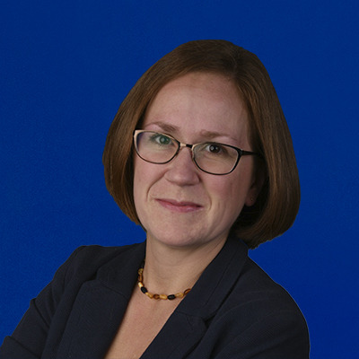

The ICI’s **Transition Leadership Program (TLP)** prepares current and prospective special educators, guidance counselors, school social workers, rehabilitation counselors, and other professionals to help students with disabilities focus on employment, college preparation, and independent living skills during the critical transition from high school to adult life.

The TLP promotes evidence-based practices for transition planning, including youth leadership, self-determination, family engagement, college career readiness, and interagency collaboration as youth advance to employment and postsecondary education after high school.

**What do Transition Specialists learn in the TLP?**

Transition Specialists provide knowledgeable, practical, and personalized guidance to students with disabilities. They are well versed in state and federal transition regulations. Transition Specialists who graduate from the UMass Boston Transition Leadership Program learn how to:

*   direct student-centered Individualized Education Planning (IEP) teams
*   focus on measurable postsecondary goals and meet transition compliance
*   coordinate and prepare transition assessments framed around students’ postsecondary goals
*   provide in-house, transition-related professional development to colleagues
*   serve as their school district’s liaison with transition expertise
*   streamline transition services that capitalize on existing school resources
*   strengthen school-parent partnerships
*   engage families in transition planning
*   conduct district and school-based transition services assessments
*   establish community partnerships with local employers and colleges

The TLP is designed so that graduates can apply what they are learning in the courses immediately back at their own schools.

**What makes ICI’s Transition Leadership Program special?**

UMass Boston is among the first and only transition specialist training programs in the US with [**university accreditation by the Council for Exceptional Children’s Division on Career Development and Transition**](https://dcdt.org/dcdt-accreditation) (DCDT). The online, 18-month, accredited transition specialist training includes five evidence-based, online courses and an immersive practicum experience at the participant’s own school or another location.

The **TLP** an approved course of study for those who want to obtain the DCDT’s national certification as a transition specialist. Professionals who complete the program are also eligible for a state-specific transition specialist endorsement.

**Transition Leadership Program project staff include:**

<b>Maria Paiewonsky, Program Director</b>

 

<b>Nancy Hurley, Program Coordinator</b>

 

<b>Clare Papay, Course Instructor</b>

The Transition Leadership Program draws on the expertise from ICI’s national centers and experts, including [Think College National Coordinating Center](https://thinkcollege.net/projects/ncc), [Think Work](https://www.thinkwork.org/), [Center on Youth Choice Youth Voice](https://youth-voice.org/), [State Employment Leadership Network](https://www.selnhub.org/home), [Future Quest Island](https://www.futurequestisland.org/#screen-login), and [Explore VR](https://www.explorevr.org/).

Want to learn more about the Transition Leadership Program? [Visit UMass Boston Online to learn more details about the certification process](https://online.umb.edu/programs/transition_leadership_certificate).

[Read an interview Transition Specialist Laine Sheilds, a TLP graduate](https://sgisdinclusion.tumblr.com/post/674384568612257792/laine-shields-transition-leadership-graduate) to learn about their experience with the program.