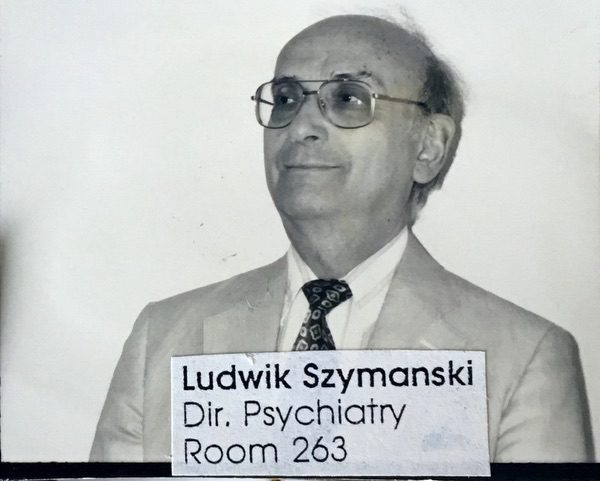
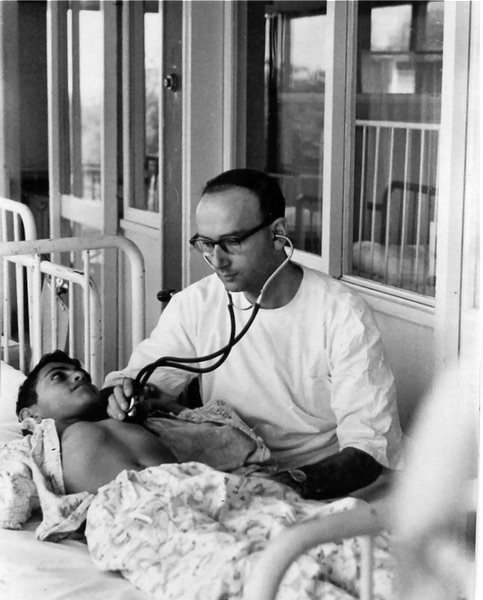
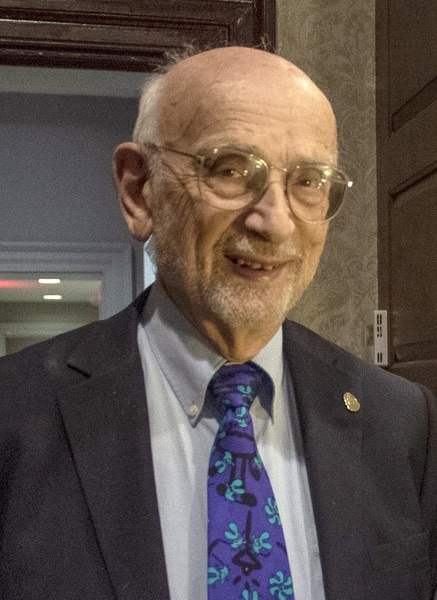
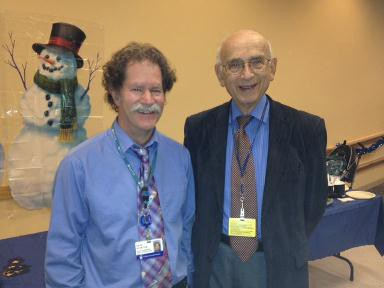

Our original founders, Dr. Alan Crocker, nurse Marie Cullinane, and Dr. Ludwik Stefan Szymanski were dedicated to exploring and improving health and social outcomes for children with developmental disabilities and their families. To this end, Dr. Alan Crocker received a federal grant from the Maternal and Child Health and Social Rehabilitation Services to open the Developmental Evaluation Clinic (DEC) as one of the first University Affiliated Facilities — the early name for what we now refer to as UCEDDs. Over the past 50+ years the DEC evolved, with clinical services continuing today under the umbrella of Developmental Medicine at Boston Children’s Hospital and the emergence of ICI as a UCEDD and leader in the disability field. Dr. Szymanski began his journey at the ICI in 1967 and has been with us ever since. On March 25, 2022, Ludwik celebrates his 90th birthday.

Throughout his career, Ludwik trained in medical residencies in Israel, New York, and Boston Children’s Hospital in pediatrics, adult psychiatry, and child psychiatry. He taught and supervised residents at Harvard Medical School and Children’s Hospital. He traveled the world, consulting with patients and hospitals, teaching, and lecturing in Poland, Finland, and across the US. Dr. Szymanski advocated to end atrocities in state schools that segregated students with disabilities. He chaired and served on Human Rights Commissions, renowned journal editorial boards, and the American Association of Jewish Holocaust Survivors and Their Descendants of New England. Dr. Szymanski met his wife during his medical training in New York and they have been married for 60 years.

In his early days at Boston Children’s Hospital, Dr. Szymanski’s job was to train and supervise student psychiatrists and develop child psychiatry programs. Dr. Szymanski and his team at the Developmental Evaluation Clinic took an interdisciplinary, hands-on approach to child developmental evaluation, building the foundation of values the ICI and Children’s Hospital advocate today. This family-centered team approach of pediatricians, child psychiatrists, psychologists, social workers, and parents was cutting edge in the 1960s and 70s when children with Down syndrome and other developmental disabilities were misunderstood and feared by many hospitals and researchers. By the 1980s, parents from all over the world were bringing their children to the Developmental Evaluation Clinic for assessments and advice.

> _“Everybody was happy to bring their kids to us so we could take care of them. But our job was not to take care of them, but rather_ **_to help the community and the parents to take care of them.”_**

When asked what motivated Dr. Szymanski to continue this work for so many years, he replied, “What motivated me… was working with the team. That was probably the most important part for me and for all of us. You were working with people who are like you. It was like one large family, sharing everything. We learned to work like a team and combine everything together and put it into one coherent recommendation and diagnosis. That became the standard and state of the art.”

After 55 years at the ICI, Dr. Szymanski is still learning from his work. “Every day I learn something. With the LEND students — they tell me what they are doing, what they learned from the families. And every single fellow said something I didn’t know and I learned from them. And that is very important, to keep your mind open.”

If you know Dr. Szymanski, celebrate his remarkable life and work by wishing him a very happy 90th birthday on March 25!