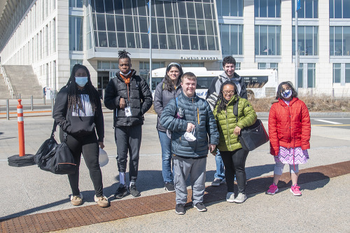

The Massachusetts Inclusive Concurrent Enrollment Initiative (MAICEI) program at UMass Boston offers inclusive higher education opportunities to partnering local school districts that support high school students with intellectual disabilities and autism, ages 18–21. Students are considered “concurrently enrolled” because they are eligible for transition services through their school district while enrolled in college at the same time. We are currently partnering with Boston Collegiate, Brooke Charter, and the Malden, Somerville, Revere, Winthrop, and Dedham public schools.

> *“We appreciate partnering with UMass Boston because it gives our students the ability to engage in the MAICEI program and experience a college atmosphere that otherwise they would not be able. The MAICEI program allows our students to meet new peers, complete internships and learn to be more independent in many facets of life. The MAICEI program is very supportive and flexible, which allows students of many disability types and levels to be able to participate. It has been a great first year working with UMass Boston and the MAICEI program!”*
> 
> — Deborah Fleet-Earl, Special Education Chairperson, Winthrop High School

At UMass Boston, students enroll in undergraduate courses, engage in social activities with their UMass Boston peer mentor, access campus events/resources, and participate in volunteer opportunities across several campus departments.

> *“The growth that our students experience on UMass Boston’s campus is irreplaceable. Our partnership with UMass Boston is important because we are serving local school districts and families in the Boston area who otherwise would not have an opportunity to be a part of our community.”*
> 
> — Ashley Luce, Program Coordinator

We have eight students enrolled in our program for Spring 2022. For Fall 2022, we are anticipating 10 new students. UMass Boston MAICEI is a part of the larger statewide initiative across Massachusetts. Fellow programs include MassArt, UMass Amherst, Bridgewater State University, and 10 other public colleges and universities.

.")

> *“What motivates me as a peer mentor is seeing student growth and seeing them benefit from the support”*
> 
> — Bella, Peer Mentor

[Learn more about the MAICEI program at UMass Boston](https://www.communityinclusion.org/projects/maicei/).