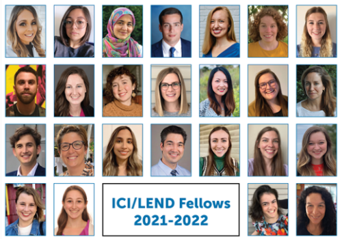
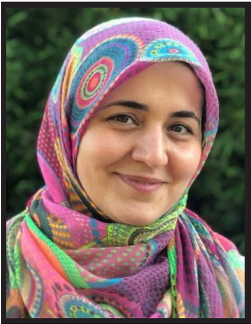
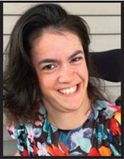
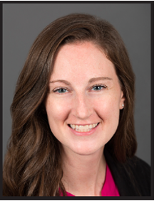

This year, 25 Leadership Education in Neurodevelopmental and Related Disabilities (LEND) fellows graduated from the Institute for Community Inclusion (ICI) and Boston Children’s Hospital LEND program. LEND fellows are self-advocates, family members of individuals with disabilities, and health and education professionals. Fellows from 12 disciplines engaged in lessons around interdisciplinary work, life course perspectives, public health, cultural competence, and family-centered care.

This year’s LEND fellow cohort included students from pediatric audiology, developmental behaviors pediatrics, neurodevelopmental disabilities, post-doctoral psychology, and occupational and physical therapy residencies.

Each of the 2021–2022 LEND fellows shared their experiences and lessons learned.

Zeinab Azarmand

Zeinab Azarmand, LEND Fellow and founder of non-profit [Khane-ye-Emad](https://khaneyeemad.ir/), shared:

> “Being a LEND Fellow, I gained invaluable insights into the world of disability. Lectures, activities, and other resources opened my eyes to the wide array of different aspects and perspectives to think about when dealing with life enhancement for individuals with Neurodevelopmental Disabilities. I noticed the importance of educating healthcare professionals, as well as the public about the needs of the disability population. I was greatly inspired by collaborating with the outstanding professionals, academicians, and organizations and by observing how their efforts have changed everyday life of individual with disabilities. The LEND program boosted my knowledge, skills, and the insight that I apply to my current and future projects across the geographical borders.”

Sarah Young

Sara Young, LEND Fellow self-advocate, worked with [Partners for Youth with Disabilities (PYD)](https://www.pyd.org/) to help young adults through the Career Readiness Program. Sara shared her experience with LEND:

> “LEND is a serious commitment of time and energy and can be challenging, but it was amazing. I am grateful for all I have learned and the wonderful people I’ve met. I highly recommend this for other self-advocates. It was a cool opportunity to work with LEND Fellows, whether it was during discussion groups or working on projects. LEND is such a great opportunity for people with disabilities and I truly felt like I was able to have a voice to share within the group.”

Erin Dunphy

Erin Dunphy, LEND Fellow and Occupational Therapy (OT) Fellow at Boston Children’s Hospital, shared:

> “I feel immensely grateful for LEND to be a part of my OT fellowship at Boston Children’s Hospital. The knowledge and skills I have gained from LEND have aligned with my clinical and didactic work from my OT fellowship as well to further my passion for being an OT. LEND has allowed me to gain further knowledge and understanding of how many barriers truly exist at the individual level as well as at the system level. Through the experience of engaging in the Hill visits and attending the Disability Policy Seminar in-person I gained a greater understanding of the role I play in advocating for equity for all individuals. The collaborative approach of LEND has encouraged me to continue strive to make a difference for the patients, families, and colleagues who I have the privilege of working with, as well as to encourage my colleagues to do the same.”

[Learn more about the LEND Fellowship Program at Boston Children’s Hospital.](https://www.childrenshospital.org/centers-and-services/departments/developmental-medicine/clinician-resources/lend-fellows)