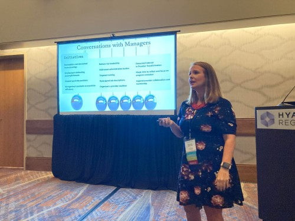
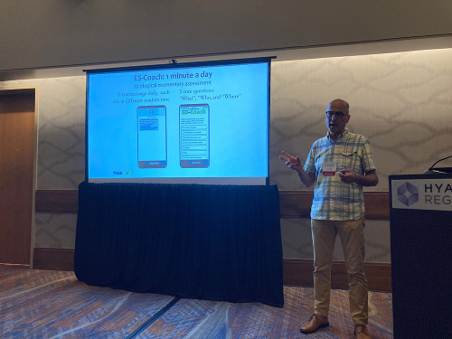
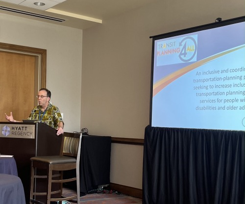

On June 14–16, several ICI and SGISD staff attended and presented at the National Association for People Supporting Employment First (APSE) Conference in Denver, CO. The theme of this year’s conference was _Moving Mountains Together_.

Alberto Migliore, Jennifer Sulewski, and Brit Miles from [ICI’s ThinkWork](https://www.thinkwork.org/authors/ici) and Micah Fleisig from [Jewish Vocational Services (JVS)](https://www.jvs-boston.org/) in Boston presented _Tools for Provider Agencies from ICI’s ThinkWork Team_, which included a discussion of ThinkWork’s [ES-Coach](https://www.thinkwork.org/check-out-es-coach), and the [Community Life Engagement Guideposts and Fidelity Scale](https://www.communityinclusion.org/projects/cle/).

DeBrittany Mitchell, Julisa Cully, and David Hoff presented on three ICI projects about apprenticeship programs. Their presentation, _Moving Equity Forward in Apprenticeship Programs_, focused on improving apprenticeship opportunities for individuals with disabilities as part of overall equity efforts in the [Rural Youth Apprenticeship Development Project](https://www.explorevr.org/content/research-projects-explorevr), the [National Innovation Hub for Diversity, Equity, Inclusion, and Accessibility in Registered Apprenticeships](https://www.jff.org/what-we-do/impact-stories/center-for-apprenticeship-and-work-based-learning/diversity-equity-and-inclusion-apprenticeship-wbl/), and the [Massachusetts Diversity and Equity in Apprenticeship Initiative](https://www.communityinclusion.org/news/2021-07_20_awards-to-expand-inclusive-apprenticeship-opportunities/).

David Hoff also presented on national public policy issues and transportation planning. David serves as co-chair of the _APSE Public Policy Committee_ and facilitated a group discussion on critical APSE-related public policy issues. He then co-presented _Getting to Work: Self-Determination and Partnering for Transportation Solutions_ with Angel Bond from [Mobility for All](https://www.bouldercounty.org/transportation/multimodal/mobilityforall/#:~:text=The%20goal%20of%20the%20Mobility,%2C%20economic%2C%20and%20health%20need.) in Boulder, CO about the work of the [Transit Planning 4 All](https://transitplanning4all.org/) initiative. Angel and David shared inclusive transportation planning practices and strategies to address the transportation challenges that people with disabilities face to fully participate in employment and all other aspects of community life.

Finally, SGISD’s Sheila Fesko co-presented _Lifting the Level of Professionalism form the Alleghenies to the Rockies_ with several others to examine the collaboration between ICI and SGISD’s College of Employment Services, Pennsylvania, and New Mexico. Sheila also staffed a table for the [College of Employment Services](https://directcourseonline.com/employment-services/) to share information about the online, self-paced learning platform.

If you missed the APSE conference or want to continue learning, join the APSE Virtual Post-Conference 3-hour workshop sessions from August 1–5, 2022. [Learn more about each workshop and how you can register.](https://apse.org/events-learning/2022-conference/)