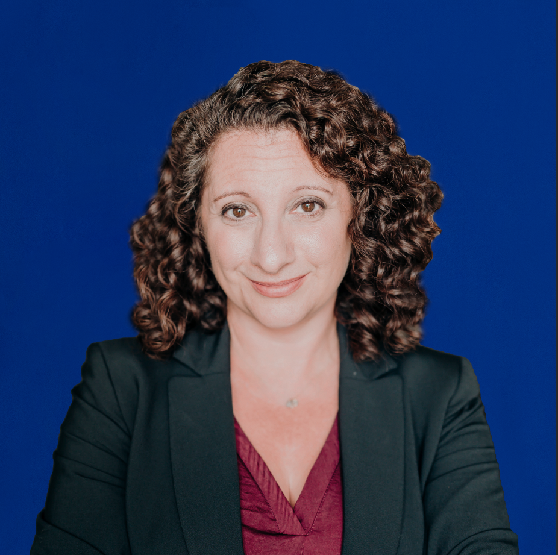
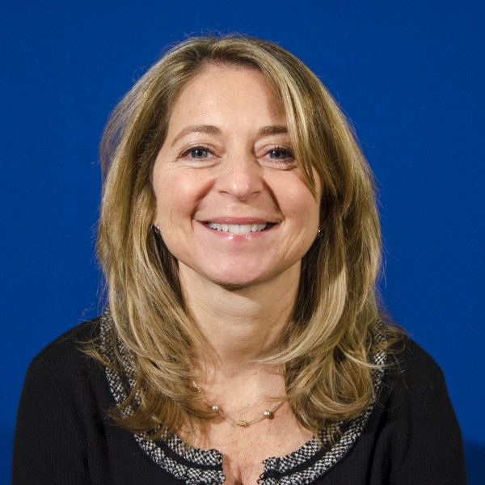
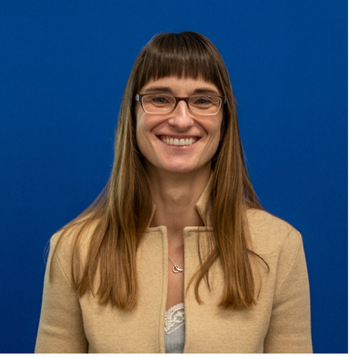
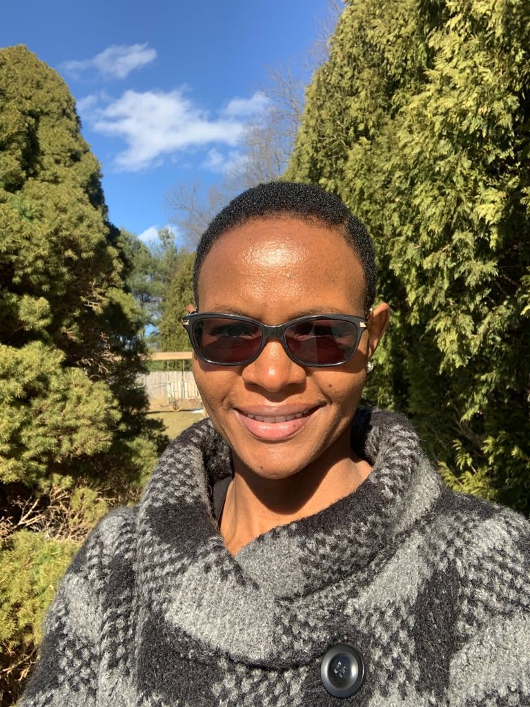

In the disability education field, **_transition_** often refers to the time in a young person’s life between middle school and early adulthood when they are considering and planning for post-high school life. Youth with disabilities often participate in a transition planning process to figure out what they want to do after high school.

During this transition planning process, many youth with disabilities and their parents learn about **_guardianship_**. Guardianship is a legal status that involves a court determining that a person cannot make their own decisions. The court then gives someone else (a guardian) the power to make decisions for that person.

The ICI’s [**Center on Youth Voice, Youth Choice (CYVYC)**](https://youth-voice.org/) is a resource center for youth with disabilities and those that support them. CYVYC does research, advocacy, and education about **_alternatives to guardianship_**. Alternatives to guardianship are ways other than guardianship for youth to get support to make important decisions about their lives.

## Why are alternatives to guardianship important?

Youth with disabilities should be the drivers of their own lives. Offering alternatives to guardianship gives youth more information to make informed choices and decisions about their post-high school futures. In many cases, guardianship is still the default option that schools and others present to students and families during the transition planning process, which can take away **self-determination** and thus be harmful to youth with disabilities.

### CYVYC has two overarching goals:

1) To support states to promote alternatives to guardianship, so that fewer youth with intellectual or developmental disabilities (IDD) have legal guardians

2) To give youth with IDD opportunities to lead efforts to promote alternatives to guardianship, like [supported decision-making](https://supporteddecisions.org/) (SDM). With SDM, people with disabilities make their own choices with the support of trusted persons in their lives and keep all their legal and civil rights.

### What does CYVYC do?

* **We share stories.** CYVYC works with youth with IDD, families, and supporters from a variety of backgrounds. This includes teachers, lawyers, medical professionals, and policy-makers. We share stories and information from many different people with disabilities and people who work with youth seeking alternatives to guardianship. [Read stories from youth who chose supported decision-making](https://youth-voice.org/stories-of-supported-decision-making/) as an alternative to guardianship.

* **We guide and support State Teams.** State Teams come up with plans to promote [alternatives to guardianship](https://youth-voice.org/glossary/alternatives-to-guardianship/) for youth (ages 14 to 26) and support their state’s [Youth Ambassadors](https://youth-voice.org/youth-ambassadors/) with this work. Each State Team develops a plan to reduce the number of guardianships in the state. CYVYC facilitates a community of practice with State Teams to come up with ideas for how to better advocate for alternatives to guardianship across states.

* **We share resources about alternatives to guardianship.** Each state has different laws and terminology around alternatives to guardianship. We share a US map on our website. You can click on your state [to learn more about alternatives to guardianship in your state](https://youth-voice.org/a2g-in-your-state/). We also share [promising practices](https://youth-voice.org/promising-practices/), [briefs](https://youth-voice.org/briefs/), and [research findings](https://youth-voice.org/research/) about alternatives to guardianship in [plain language](https://youth-voice.org/plain-language-series/).

### How can I learn more about CYVYC and alternatives to guardianship?

Visit the [Center on Youth Voice, Youth Choice website](https://youth-voice.org/) to learn more!

**ICI CYVYC Staff:**

Allison Cohen-Hall, Project Director

Jaimie Timmons, Co-Project Director

Daria Domin, Research Associate

Esther Kamau, Research Associate

**CYVYC Advisory Board:**

We have six advisors who help guide us and our work. [Meet the CYVYC Advisory Board!](https://youth-voice.org/advisory-board/)

**CYVYC Youth Ambassadors:**

Our Youth Ambassador Program is a training program that supports youth to be leaders in their states and promote alternatives to guardianship. We have 15 Youth Ambassadors from Vermont, Wisconsin, and Georgia. We welcomed and are currently training another 20 Youth Ambassadors from Indiana, Michigan, New Jersey, Oregon, and South Carolina. [Meet our CYVYC Youth Ambassadors](https://youth-voice.org/youth-ambassadors/)!

**CYVYC Partners:**

CYVYC is a partnership between the ICI, the Center for Public Representation (CPR), Self Advocates Becoming Empowered (SABE), Human Services Research Institute (HSRI), the Georgia Advocacy Office (GAO) and consultants from the Harvard Law School Project on Disability (HPOD).

CYVYC receives funding from the Administration for Community Living (ACL) at the US Department of Health and Human Services (HHS).