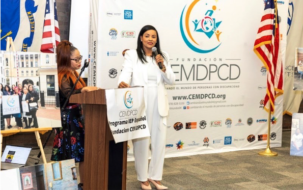

Earlier this year, we held the graduation ceremony for the first training session of the Individualized Education Program (IEP) of the Changing the World of People with Disabilities Foundation for Spanish-speaking parents, held in Spanish with English translation.

Below, we provide the blog in Spanish, as the speech and the event originally took place. We have included an English translation after the Spanish version.

**_En español:_**

El mes pasado celebramos la graduación de la primera sesión de entrenamiento del Plan de Educación Individual (PEI) de la Fundación Cambiando el Mundo de Personas con Discapacidad para los los padres hispanos realizada en español con interpretación en inglés, la graduación fue una verdadera celebración.

Raquel Quezada, antigua _miembro_ de los Programas de Liderazgo en Educación en Discapacidades del Neurodesarrollo y Discapacidades Asociadas (LEND) y de Allen C. Crocker, ella es la fundadora de esta organización. Se trata de lo que ella anticipa sea tan solo el primer entrenamiento de muchos para apoyar a familias latinas que tienen niños con discapacidades.

Además de proporcionar entrenamiento cultural y lingüísticamente competente, Raquel se concentra en el empoderamiento, algo que promueve a través de visitas al ayuntamiento de Lawrence y a la Cámara Estatal de Massachusetts. Trabaja junto con su esposo para ayudar a otros padres latinos proporcionándoles entrenamientos y orientaciones. Su organización ha tenido éxito con los graduados, los cuales incluyen al propio esposo de Raquel y a varios otros padres.

**Raquel tiene una pasión impresionante por esta labor. He aquí el discurso de Raquel Quezada en la celebración de la graduación del mes pasado:**

**Un Cambio a una Mirada Positiva Hacia las Personas con Discapacidad**

“Todos los seres humanos nacen libres e iguales en dignidad y derechos”, es la primera frase de la Declaración Universal de Derechos Humanos adoptada por la Asamblea General de las Naciones Unidas en 1948. Hoy, más de 70 años más tarde; aún existen millones de personas con discapacidades cuyos derechos humanos se encuentran seriamente limitados o son totalmente negados, no solo en los Estados Unidos; sino en el mundo entero.

A lo largo de estos años se han logrado considerables progresos, gracias a muchas personas, profesionales, organizaciones y políticos, que hacen con la ayuda de los padres y de las personas con discapacidad leyes que se hacen cumplir, pero todavía queda un largo camino por recorrer y mucha educación por ofrecer para cambiar la mirada hacia y en favor de este colectivo de personas.

Las personas que tienen alguna discapacidad tienen el derecho de vivir en su comunidad, disfrutar de la salud y el bienestar, de recibir una buena educación y de tener la oportunidad de trabajar, y sobre todo de ser incluidas y aceptadas por la sociedad.

El tener un hijo con discapacidad ya es suficiente difícil para los padres, y si ellos trabajan es aún mucho más difícil. Es también una tarea difícil tener que salir a abogar por los derechos de sus hijos exigiendo que se les proporcione una educación especial que sea 100% buena y eficaz.

Los padres también pasan por muchas luchas, peleas, frustraciones, rechazo de la sociedad; a veces su dinámica familiar se rompe por estresante que es tener a un persona con discapacidad y salud mental en su hogar, el índice de divorcio es mayor cada día más para esta comunidad, lo que conlleva a la madre a quedarse sola.

No es posible que en el 2022 en este siglo todavía estemos nosotros abogando por nuestros hijos por tener algunas condiciones, enfermedades raras, o una discapacidad.

Los padres quieren lograr que sus hijos alcancen el máximo potencial de su desarrollo, que sean vistos por su potencial; y que no se les encasille respecto a sus debilidades. Quieren tener lugares, parques, escuelas, y programas donde ellos puedan desarrollarse y ser feliz; pero sobre todo, que sean aceptados tal y como son.

Conseguir este cambio requiere enriquecer la visión de la sociedad que queremos… nos comprometemos a seguir haciendo más programas educativo totalmente gratuitos para los padres como el que tiene esta organización, para que luego que los padres reciban estos entrenamientos, puedan aplicar sus conocimientos con el sistema educativo, donde ellos puedan trabajar en equipo con los maestros y los beneficiados sean sus hijos.

Dándole la oportunidad de incorporarse en la comunidad trabajando y siendo independientes.

Nuestra esperanza como padres es que el mundo sea un lugar inclusivo en el que se valore a las personas con discapacidades por su potencial; que tengan las mismas oportunidades, y que haya acciones positivas que garanticen la inclusión social y positiva.

Ojalá que haya más padres que defiendan a sus niños y que sean defensores en búsqueda de más oportunidades para sus niños porque estos se merecen lo mejor.

Queremos que las personas con discapacidades se empoderen a sí mismos para que cuando sus padres ya no se encuentren aquí, ellos puedan abogar por sí mismos. Esto se logra cuando existe un padre empoderado.

A los padres: gracias por permitirnos compartir con ustedes estos tres meses de entrenamiento, por permitirnos llegar a conocer sus historias, conectarlos con recursos y decirles que no están solos.

Hoy les digo que sigan adelante con su conocimiento, sigan abogando por sus niños, recuerden hoy que ustedes son las voces de sus niños. Si no lo hacen, nadie lo hará. Empodérense con el conocimiento para que mañana puedan empoderar a sus niños para que puedan defenderse.

A sus ciudadanos, políticos, gobernadores, educadores, organizaciones e instituciones privadas les digo: cambiar la manera en que el mundo ve a las personas con discapacidades para otorgarles los derechos que se merecen y las oportunidades que se merecen depende de ustedes. Eliminen las barreras que les impiden ser incluidos en la sociedad. Les aseguro que si trabajamos juntos con los padres, su labor se hará más fácil.

Hubo un discurso pronunciado en Washington, D.C, capital de los Estados Unidos el 28 de agosto de 1963 por Martin Luther King Junior titulado **“Tengo un Sueño”**, un solo sueño, seguir soñando; y yo también tengo un sueño, y es que el tema de la discapacidad no sea un tema que discutir, o por igual; que la educación especial sea solo educación y punto.

Padres, se vale soñar porque los sueños se hacen realidad, pero debemos de seguir luchando por un mundo mejor a favor de las personas con discapacidad, dejando ese legado de nuestra lucha a las generaciones venideras.

¡Muchísimas gracias!

**_In English:_**

Recently, we held the graduation ceremony for the first training session of the Individualized Education Program (IEP) of the Changing the World of People with Disabilities Foundation for Spanish-speaking parents, held in Spanish with English translation. The graduation was a true celebration.

Raquel Quezada, a former Fellow of the Leadership Education for Neurodevelopmental and Related Disabilities (LEND) programs and of the Allen C. Crocker Family Fellowship, is the founder of this organization. She anticipates that it will serve as just the first training of many for people in support of Latino families who have children with disabilities.

In addition to offering competent cultural and linguistic training, Raquel focuses on empowerment, which she promotes through visits to the City Hall of Lawrence as well as the Massachusetts State House. Together with her husband, she works on helping other Latino parents by offering them training and orientation. Her organization has achieved success with the graduates, including her own husband and many other parents.

**Raquel has impressive passion for this work. Here is Raquel Quezada’s speech at the graduation ceremony held last month:**

 

**A Change toward a Positive View of People with Disabilities**

“All human beings are born free and equal with dignity and rights.” This is contained in the first sentence of the Universal Declaration of Human Rights, adopted by the General Assembly of the United Nations in 1948. Today, more than 70 years later, there are still millions of people with disabilities whose human rights are seriously limited or are totally denied, not only in the United States, but in the entire world.

Over the years, considerable progress has been made thanks to many people, professionals, organizations and politicians who, with the help of parents and people with disabilities, ensure that the laws are fulfilled, but there is still a long road ahead of us and much education to be shared in order to change views of and on behalf of this group of people.

People living with a disability have the right to live in their community, to enjoy health and well-being, to receive a good education and have the opportunity to work, and above all to be included and accepted by society.

Having a child with a disability is difficult enough for parents, and if they work it is even more difficult. It’s also a difficult task to have to go out and advocate for the rights of their children, demanding that they be provided special education that is 100% suitable and effective.

Parents also face many struggles, battles, frustrations, and denial on the part of society. At times, the family dynamic is torn by the stress of having a person with a physical or mental health disability in their home. The divorce index is constantly increasing in this community, which also leaves more women alone.

It’s just not possible that in 2022, in this century, we are still advocating for our children because they have certain conditions, rare diseases, or some disability.

Parents want their children to be able to reach maximum potential in their development, to be seen reaching that potential, and not to be classified with respect to their disabilities. They want to have places, parks, schools and programs where they can develop and be happy. But, overall, that they be accepted exactly as they are.

To bring about this change requires enriching the vision of society as we would like it to be… We are committed to continuing to offer educational programs for parents, completely free of charge, like the one offered by this organization, so that parents may then receive this training, apply their knowledge to the educational system, where they can work in teams with instructors and the beneficiaries will be their children, thus providing them the opportunity to be incorporated into the community, working and being independent.

Our hope as parents is that the world should be an inclusive place in which people with disabilities are valued for their potential, that they have the same opportunities, and there is positive action that guarantees social and positive inclusion.

Hopefully, there will be more parents defending their children and championing the quest for more opportunities for their children because they deserve the best.

We would like for people with disabilities to be empowered over themselves, so that when their parents are no longer here, they can advocate for themselves. This is achieved by empowering parents.

To parents: thank you for allowing us to share with you these three months of training, for allowing us to hear your stories, connecting you with resources and letting you know that you are not alone.

Today, I say to you, continue with your learning, continue advocating for your children, remember today that you are the voices of your children. If you don’t do it, no one will. Empower yourselves with knowledge so that tomorrow you can empower your children to be able to defend themselves.

To citizens, politicians, governors, educators, private organizations and institutions, I say: to change the way in which the world views people with disabilities in order to grant them the rights they deserve and the opportunities they deserve depends on you. Eliminate the barriers that prevent their inclusion in society. I assure you that if we work together with parents, your work will be easier.

A speech was given in Washington, D.C., capital of the United States, on August 28, 1963, by Martin Luther King, titled “I Have a Dream,” a single dream, to keep on dreaming; and I too have a dream, and that is that the issue of disabilities will no longer be an issue to be argued about, and that, likewise, special education will just be education, period.

Parents, it’s worth dreaming because dreams become reality, but we must continue the struggle for a better world on behalf of people with disabilities, to leave the legacy of our struggle for future generations.

Thank you very much!
