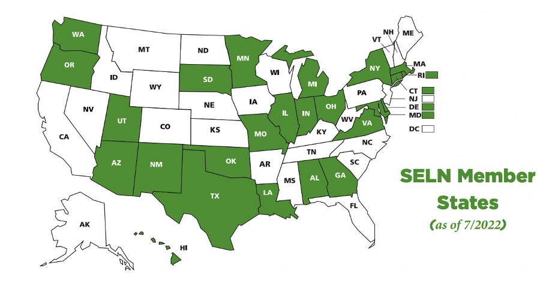

This July, the State Employment Leadership Network (SELN) kicked off membership year 17!

The SELN is a collaborative effort between the [ICI](http://www.communityinclusion.org/) and the [National Association of State Directors of Developmental Disabilities Services](https://www.nasddds.org/) (NASDDDS). Currently, 25 state intellectual and developmental disabilities (IDD) agencies have committed to improving integrated employment outcomes for the 2022–2023 membership year.

These IDD agencies connect, collaborate, and share information and lessons learned across state lines and system boundaries. The SELN fosters cross-community support around important employment-related policies at the state and federal levels.

Each year, the ICI and NASDDDS help each state develop customized work plans around integrated employment initiatives to meet their unique needs.

Visit the [SELN Hub](https://www.selnhub.org/home) to learn more about each state and the community of practice.

