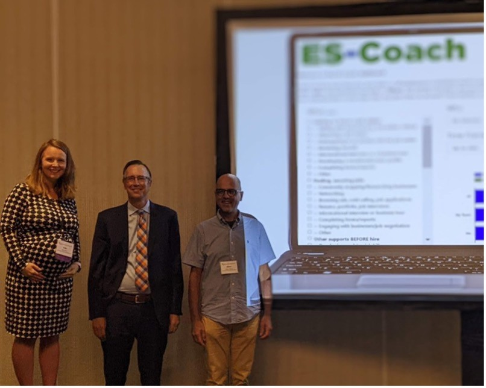
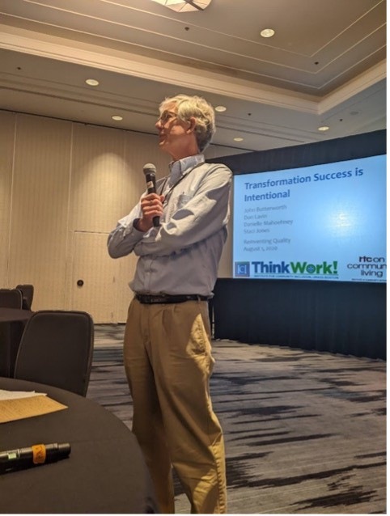
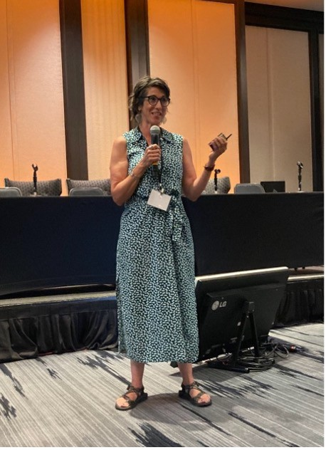
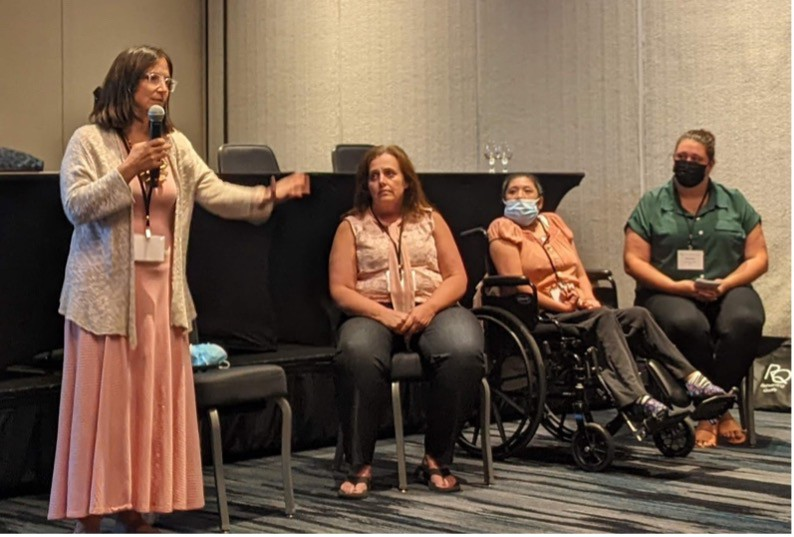
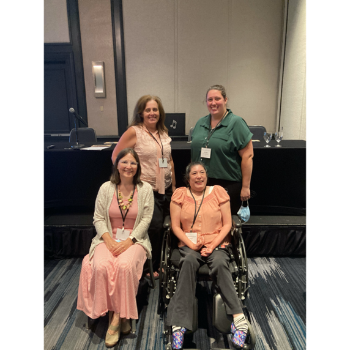

This summer, ICI staff John Butterworth, Staci Jones, Alberto Migliore, Brit Miles, and Jen Sulewski led three sessions at the [Reinventing Quality Conference](https://reinventingquality.org/about-reinventing-quality) in Baltimore with key partners from the community and the University of Minnesota Institute on Community Integration. John Butterworth also co-chaired the employment strand of the conference.

Since 1991, the Reinventing Quality Conference has showcased best practices in person-centered community and employment supports from across the nation.

Alberto Migliore and Brit Miles co-presented **_Beyond training: Leveraging Data to Deliver Evidence-Based Employment Supports and Improve Job Outcomes_** with Jeff Gentry from Jewish Vocational Services (JVS) Boston. The session profiled [ES-Coach](http://es-coach.org/), ICI’s web-based tool designed to provide data-enabled feedback to employment consultants and help them with implementing best practices in employment supports.

John Butterworth and Staci Jones co-presented **_Transformation Success is Intentional_** with Don Lavin from Strengths@Work and Danielle Mahoehney from the University of Minnesota. This session addressed provider and state experiences supporting transformation from traditional services to competitive integrated employment using a research-based framework that identified [10 key elements of organizational transformation from ThinkWork](https://act.thinkwork.org/).

Jen Sulewski co-presented **_Employment First Doesn’t mean Employment Only: Tools for Supporting Community Life Engagement_** with Kelly Paparazzo, Mercedes McKeel, and Jessica Chen, from Maryland’s Seeking Employment, Equality and Community (SEEC). Jen shared actionable tools and strategies for service providers looking to increase community life engagement (CLE) of the people they support, including the [Community Life Engagement Toolkit](https://cletoolkit.communityinclusion.org/), the Guideposts Fidelity Scale (GFS), and the CLE Online Module for direct support professionals.

Learn more about the [Reinventing Quality Conference](https://reinventingquality.org/about-reinventing-quality)!