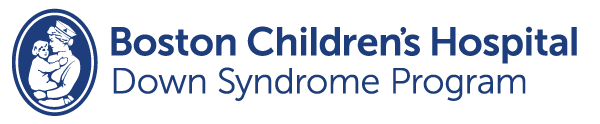

The [Down Syndrome Program at Boston Children’s Hospital](https://www.childrenshospital.org/programs/down-syndrome-program) offers specialized services for children with Down syndrome and their families. The original home of the Institute for Community Inclusion, the program supports children and young adults with Down syndrome from birth through age 22. Services include family support, referrals to affiliated clinics, and prenatal consultations.

Boston Children’s Hospital has been named the #1 children’s hospital in the country multiple times by U.S. News & World Report. The Down Syndrome Program allows families to access the unparalleled resources of this leading hospital. It also offers personal connections such as a patient liaison (a young person with Down syndrome who helps guide a family through using the program).

Learn more about the [Down Syndrome Program.](https://www.childrenshospital.org/programs/down-syndrome-program)
