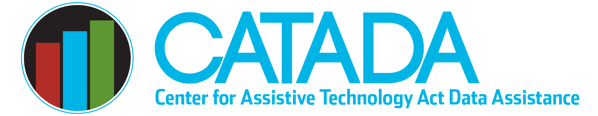

The [Center for Assistive Technology Act Data Assistance](https://catada.info/) (CATADA) provides technical assistance and supports to state Assistive Technology (AT) programs. AT is any item, piece of equipment, or system that is used to increase, maintain, or improve functional capabilities of individuals with disabilities.

State and territory AT programs improve the provision AT through comprehensive, statewide programs that are consumer-responsive. The goal of these programs is to increase access to and acquisition of AT. Programs serve people with all types of disabilities, of all ages, in all environments. Strategies used by AT programs include device reuse initiatives and financial loans to ensure that AT is available to everyone who needs it.

[Explore CATADA’s work advancing AT across the nation.](https://catada.info/)
