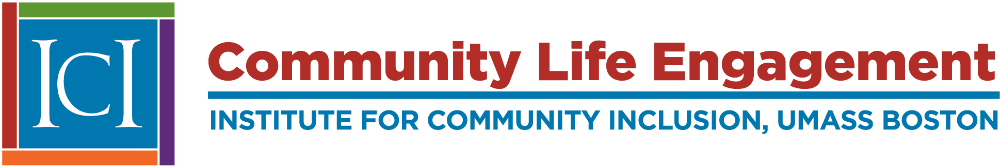

Community life engagement refers to all the ways that people with intellectual and developmental disabilities access and participate in their communities outside of employment. Activities can include volunteer work; postsecondary, adult, or continuing education; accessing community facilities such as the library, gym, or recreation center; any activities that people with and without disabilities do in their spare time. CLE activities may support  career exploration  , wrap around work time, or serve as a retirement option. ICI is conducting research on CLE to develop guidance for states and service providers on how to improve CLE supports while maintaining a focus on Employment First.

This [one-page, accessible flyer](https://www.thinkwork.org//sites/default/files/files/CLE_flyer_2023_PL.pdf) provides a plain language overview of the definition of Community Life Engagement, and the four most important things to consider:

## Community Life Engagement Toolkit is here

The toolkit was developed to help service providers develop and improve high quality supports for community life engagement (CLE). It contains guideposts for success, a self-assessment tool, real-world examples of service providers making CLE happen, and other helpful resources and tools.  You can access the CLE toolkit here:  [https://cletoolkit.communityinclusion.org/](https://cletoolkit.communityinclusion.org/)

For more information on these efforts, see our two publications series (Engage and Promising Practices) and past presentations:

## Engage Briefs

These brief products describe findings and insights from our ongoing research on CLE, including description of the four CLE Guideposts and how they are put in practice at case study sites. Read the series here:  [Community Life Engagement Engage Series](http://www.thinkwork.org/cle/engage-brief-series).

## Promising Practices in Community Life Engagement

A collaborative effort with the  [Access to Integrated Employment project](http://www.thinkwork.org/aie)  , these publications highlight service provider practices that enhance CLE for people with IDD while maintaining a focus on employment.  [Read the Access to Integrated Employment and Community Life Engagement Promising Practices series here.](http://www.thinkwork.org/cle/promising-practices-community-life-engagement)

## Community Life Engagement Presentations

[Look here for past presentations](http://www.thinkwork.org/cle/presentations)  from the Community Life Engagement.

## Major activities

- Engaging with State Employment Leadership Network to identify emerging needs and issues at the state level.
- Conducting interviews with 13 knowledgeable people representing state IDD agencies, service providers, researchers, family members, and individuals with IDD.
- Conducting case studies of Community Life Engagement efforts at three exemplary service providers.
- Developing a promising practices series on state and service provider implementation of Community Life Engagement.
- Surveying state IDD agencies about their Community Life Engagement policies and practices.
- Developing, piloting, refining, and disseminating guideposts and toolkits for states and service providers.

## Project Team

Jennifer Sullivan Sulewski, Principal Investigator

[Jaimie Timmons](mailto:jaimie.timmons@umb.edu), Senior Research Associate

[Allison Hall](mailto:Allison.hall@umb.edu), Senior Research Associate

[Oliver Lyons](mailto:oliver.lyons@umb.edu), Research Study Coordinator

For more information on ICI's work on community life engagement contact:  
[Staci Jones](mailto:mailto:Staci.Jones@umb.edu), Senior Technical Assistance and Policy Associate