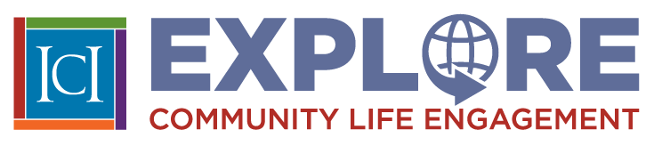
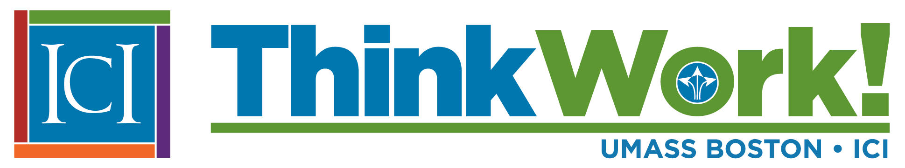

  

<nav class="ecle-toplinks" aria-label="Explore Community Life Engagement quick links">
  <ul>
    <li><a href="https://cletoolkit.communityinclusion.org/" class="btn btn-outline-primary">CLE Toolkit</a></li>
    <li><a href="https://act.thinkwork.org/" class="btn btn-outline-primary">Agency Change Toolkit</a></li>
    <li><a href="https://elearning.communityinclusion.org/browse/cle" class="btn btn-outline-primary">CLE Courses</a></li>
    <li><a href="https://cletoolkit.iciboston.org/resources/engage-briefs" class="btn btn-outline-primary">Publications</a></li>
  </ul>
</nav>

  <h2 class="ecle-diagram-title">Holistic Agency Alignment</h2>
  

    

      

        <h3>Focus and Values</h3>
        <ul>
          <li>Clear and consistent goals</li>
          <li>Agency promotes belonging</li>
        </ul>
      

      &#8596;
      

        <h3>Infrastructure</h3>
        <ul>
          <li>Properly allocated resources</li>
          <li>Strong communication plan</li>
          <li>Ongoing staff development</li>
          <li>Performance measurement &amp; QA</li>
          <li>Community partnerships</li>
        </ul>
      

    

    

      &#8597;
      &#8597;
    

    

      <h3>Employment &amp; Community Life Engagement Practices</h3>
      <ul class="ecle-practices-list">
        <li>A holistic approach</li>
        <li>Customer focus &amp; engagement</li>
        <li>Active person-centered job development</li>
        <li>Promotes community membership</li>
        <li>Outcome-oriented &amp; monitored supports</li>
        <li>Develop relationships &amp; build skills to reduce reliance on paid staff</li>
      </ul>
    

  

  
Focus and Values, Infrastructure, and Employment &amp; Community Life Engagement Practices are interconnected and reinforce one another.

  

    

      
    

    

      
    

  

## What is a holistic approach?

A holistic approach looks at **the whole person**, not just one outcome.

## Align your agency's work

What can you do to make sure everyone is on the same page?

- Create a shared vision and shared goals
- Look at how your agency functions to make sure everyone is working together
- Make a commitment to employment, community life engagement, and opportunities for all people

## Why does a holistic approach work so well?

By intentionally working together, you can:

- make the most of limited resources
- avoid doing the same work twice
- help people with disabilities to get what they need

  

    <a href="https://act.thinkwork.org/" class="card shadow-sm p-3 text-center ecle-card">
      
Are you ready to make a commitment to holistic agency alignment? 
      Explore the Agency Change Toolkit!

      
    </a>
  

  

    <a href="https://cletoolkit.communityinclusion.org/" class="card shadow-sm p-3 text-center ecle-card">
      
Are you ready to improve meaningful community life engagement for the people you support? 
      Explore the CLE Toolkit!

      
    </a>
  

