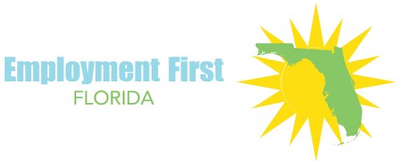

In 2011, ICI entered into a partnership with the Florida Developmental Disabilities Council to develop an Employment First Initiative in Florida. In 2016, the Employment First Florida Act was passed. Since then, the project has developed and implemented a systems change framework based upon the High Performing States Model. It guides collaborative partners in transformation of service delivery.

Employment First Florida engages with the wider community through online presentations and a blog-based website featuring Explore Work, a curriculum for self-advocates.
