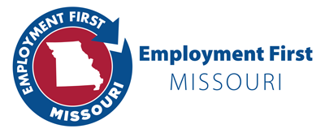

Missouri’s Employment First policy states that community integrated employment services and supports are the first service option and primary outcome for people with disabilities, and that individual integrated employment is the preferred option for everyone.

Employment First Missouri is available to provide training and technical assistance to service providers and staff to make this Employment First vision a reality, and advance community employment for individuals with intellectual and developmental disabilities in Missouri. Funding for this initiative is provided by the Missouri Department of Mental Health, Division of Developmental Disabilities (DD) to the Institute for Community Inclusion (ICI) at the University of Massachusetts Boston. In-state training and technical assistance staff work throughout the entire state of Missouri, providing services which have areas of focus such as: service flow and structure, business engagement, building of staff competencies, engaging participants and their families and systems of support, diversifying funding sources, and the development of community partners.

As a leading training, TA, research, and direct service organization focused on the full inclusion of people with disabilities in mainstream society, ICI has extensive and long-term experience on a national basis working with service providers and public systems on advancing employment.