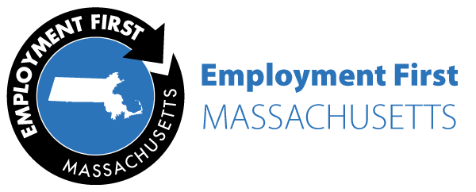

[EmploymentFirstMA](https://employmentfirstma.org/) supports the implementation of Employment First strategies and policies in Massachusetts. Employment First is a framework for systems change used across the nation. This framework promotes the idea that all people, with and without disabilities, are able to fully participate in competitive, integrated employment and community life.

EmploymentFirstMA is hosted by ICI and funded by the [Massachusetts Department of Developmental Services](https://www.mass.gov/orgs/department-of-developmental-services) (DDS). This initiative assists providers with the transformation from center-based work to work in the community. ICI provides training, technical assistance, and access to a wide range of tools and resources that support the [Blueprint for Success](http://www.mass.gov/eohhs/docs/dmr/blueprint-for-success.pdf), DDS’s plan for improving integrated employment outcomes across the state.

[Learn how Employment First is becoming a reality in Massachusetts.](https://employmentfirstma.org/)
