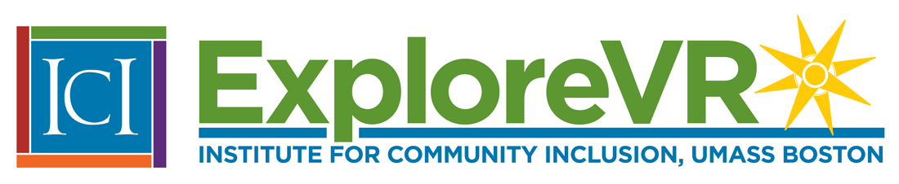

[ExploreVR](https://www.explorevr.org/) gives vocational rehabilitation (VR) agencies easy and convenient access to a range of VR research, related data, and tools for planning, evaluation, and decision-making. Users can watch videos highlighting success stories of VR clients who have found fulfilling work in their communities. A range of toolkits provide resources on topics such as business engagement and labor market information.

ICI conducts a wide range of research related to VR, such as the [Substantial Gainful Activity (SGA) project](https://www.explorevr.org/returntoworkssdi), which focused on improving the wage outcomes of people receiving Social Security Disability Insurance. Members of the SGA team implemented a model demonstration rigorously testing a rapid engagement coordinated team approach in Kentucky and Minnesota.

Learn how [Explore VR supports research and innovation around employment](https://www.explorevr.org/).
