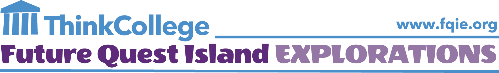

[Future Quest Island (FQI)](https://thinkcollege.net/about/what-is-think-college/future-quest-island) is an accessible, game-based college and career readiness tool for middle schoolers with and without disabilities. Through an engaging online platform, FQI aligns 21st-century technology skills with educational and employment goals.

FQI is aimed at middle school general and special education teachers, as well as technology professionals, counselors, administrators, and transition professionals. Its goal is to advance the engagement and transition plans of youth with and without disabilities so that they can build a robust path to lifelong success, in middle school and beyond.

Learn more about how [Future Quest Island engages middle schoolers.](https://thinkcollege.net/about/what-is-think-college/future-quest-island)
