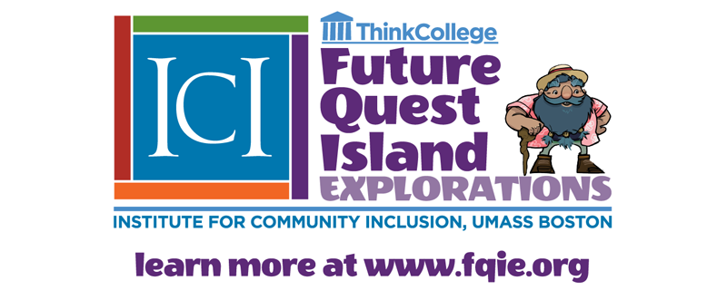
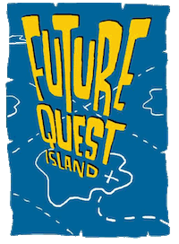

**[Future Quest Island-Explorations (FQI-E)](https://thinkcollege.net/projects/fqie)** is an online accessible college & career readiness curriculum that uses gaming strategies to motivate and support improved self-concept, social and emotional competence, and early college and career awareness for upper elementary students with and without disability in grades 3-5 using the evidenced-based “Possible Selves” framework.

This online curriculum allows students to choose an avatar and hovercraft where they progress through a series of lessons on a cluster of islands, focusing on various aspects of their possible selves. The Possible Selves framework addresses individuals’ perceived future self-concept and guides students in thinking about the future with an emphasis on nurturing academic and personal motivation. It includes components of self-concept that have to do with ‘what I can be, what I would like to be, and what I am afraid of becoming’ (Ruvolo & Markus, 1992). Through a structured process, students describe their hoped-for, expected, and feared possible selves and use the information to create a visual representation of their “Possible Self.”

Using the principles of universal design for learning, FQI-E is designed so that all students can create e-portfolios of their hopes, dreams, and goals as a person, learner, worker, and friend. These e-portfolios can then assist IEP teams in developing better secondary and post-secondary goals and outcomes for students.

FQI-E is currently funded by the U.S. Department of Education, Stepping Up to Technology Grant at [OSEP](https://sites.ed.gov/osers/tag/stepping-up-technology-implementation/) from 2019-2023.

To learn more about the project, please visit [Future Quest Island-Explorations (FQI-E)](https://thinkcollege.net/projects/fqie).

**If you are a student trying to login to Future Quest Island - Explorations, please visit [www.fqie.me](https://fqie.me/login).**

---

**[Future Quest Island (FQI)](https://thinkcollege.net/about/what-is-think-college/future-quest-island),** is an accessible, game-based college and career readiness tool for middle schoolers with and without disabilities. Through an engaging online platform, FQI aligns 21st-century technology skills with educational and employment goals.

Future Quest Island was designed for middle school general and special education teachers, as well as technology professionals, counselors, administrators, and transition professionals. Its goal is to advance the engagement and transition plans of youth with and without disabilities so that they can build a robust path to lifelong success, in middle school and beyond.  
  
FQI was funded by the U.S. Department of Education, Stepping Up to Technology Grant at [OSEP](https://sites.ed.gov/osers/tag/stepping-up-technology-implementation/) from 2012-2018.

Learn more about how [Future Quest Island engages middle schoolers](https://thinkcollege.net/about/what-is-think-college/future-quest-island).

 