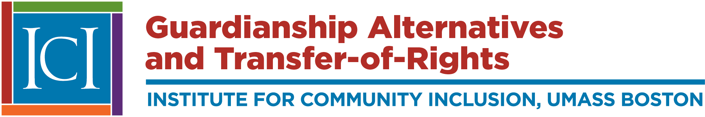

[Guardianship Alternatives and Transfer-of-Rights (GATOR)](https://gator.communityinclusion.org) is a 4-year project funded in 2019 by the Institute on Education Science at the US Department of Education. GATOR aims to explore the relationship between special educators’ transfer-of-rights and guardianship discussions and key predictors of transition outcomes for students with intellectual and developmental disabilities (IDD). Emerging research identifies that during transfer-of-rights discussions, special educators routinely provide guardianship-related information to students with IDD and their parents. Because guardianship transfers decision making authority from student to parent, providing information on guardianship may undermine core aims of special education programs and affect the transition outcomes of students with IDD.

The _Institute for Community Inclusion at the University of Massachusetts Boston_ is partnering with the _[Self Advocacy Association of New York State (SANYS)](https://sanys.org/)_ and _[Massachusetts Advocates Standing Strong (MASS)](https://www.wearemass.org/)_, in consultation with the _[Harvard Law School Project on Disability (HPOD)](https://hpod.law.harvard.edu/)_ to implement this project.

Major project activities:

- Conduct a scoping literature review about guardianship, transfer-of-rights, and transition planning conduct

- Write a 50-state analysis of special education transfer-of-rights laws

- Interview national experts on guardianship and supported decision making in the context of transition planning

- Interview students with IDD, their parents, and teachers about transfer-of rights and guardianship in Massachusetts and New York
- Develop a theoretical framework for understanding how transfer-of-rights processes conducted during transition planning may affect post-school outcomes for students with IDD

Visit [GATOR](https://gator.communityinclusion.org) to learn more!
