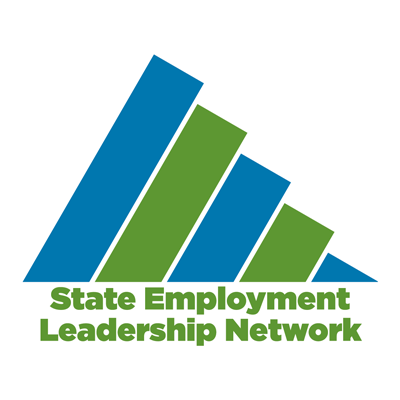
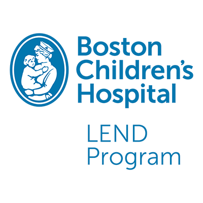
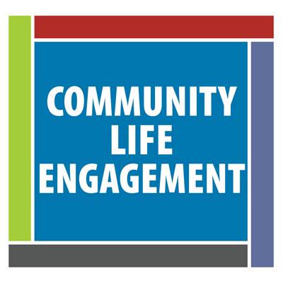

<article class="card">

<a class="link  w-100  pb2 mt2 dim dark-blue" href="/projects/thinkcollege">
<h2 class="f3 fw1 mt0 lh-title bb bw2">Think College</h2>
</a>

Think College develops, expands, and improves inclusive higher education options for people with intellectual and developmental disabilities.

</article>

<article class="card">

<a href="/projects/nercve" class="link w-100  pb2 mt2 dim dark-blue">
<h2 class="f3 fw1 mt0 lh-title bb bw2">NERCVE</h2>
</a>

The Northeast Resource Center for Vision Education (NERCVE) trains professionals to support people with blindness and low vision in accessing education and living independently.

</article>

<article class="card">

<a class="link w-100  pb2 mt2 dim dark-blue" href="/projects/explorevr">
<h2 class="f3 fw1 mt0 lh-title bb bw2">ExploreVR</h2>
</a>

Explore VR offers vocational rehabilitation (VR) agencies easy and convenient access to a range of VR research, related data, and tools for planning, evaluation, and decision-making.

</article>
<article class="card">

<a class="link w-100  pb2 mt2 dim dark-blue" href="/projects/employmentfirstma">
<h2 class="f3 fw1 mt0 lh-title bb bw2">EmploymentFirstMA</h2>
</a>

EmploymentFirstMA promotes community-based paid employment for Massachusetts citizens with intellectual and developmental disabilities. 

</article>

<article class="card">

<a class="link w-100  pb2 mt2 dim dark-blue" href="/projects/thinkwork">
<h2 class="f3 fw1 mt0 lh-title bb bw2">ThinkWork!</h2>
</a>

ThinkWork! is the hub for an array of programs related to employment for people with intellectual and developmental disabilities.

</article>
<article class="card">

<a class="link w-100  pb2 mt2 dim dark-blue" href="/projects/statedata">
<h2 class="f3 fw1 mt0 lh-title bb bw2">StateData.info</h2>
</a>

StateData.info offers publications and data related to employment and disability. Users can view trends and build charts to help drive systems change.

</article>

<article class="card">

<a class="link w-100  pb2 mt2 dim dark-blue" href="/projects/seln">
<h2 class="f3 fw1 mt0 lh-title bb bw2">SELN</h2>
</a>

The State Employment Leadership Network (SELN) brings together state developmental disability agencies for education and guidance on employment practices and policies.

</article>
<article class="card">

<a class="link no-underline w-100  pb2 mt2 dim dark-blue" href="/projects/catada">
<h2 class="f3 fw1 mt0 lh-title bb bw2">CATADA</h2>
</a>

The Center for Assistive Technology Act Data Assistance (CATADA) provides technical assistance and supports to state assistive technology programs.

</article>

<article class="card">

<a class="link w-100  pb2 mt2 dim dark-blue" href="/projects/fqi">
<h2 class="f3 fw1 mt0 lh-title bb bw2">Future Quest Island</h2>
</a>

Future Quest Island is an accessible, game-based college and career readiness tool for middle schoolers. It promotes self-advocacy to help young people plan for future success.  

</article>
<article class="card">

<a class="link w-100  pb2 mt2 dim dark-blue" href="/projects/lend">
<h2 class="f3 fw1 mt0 lh-title bb bw2"> LEND Boston</h2>
</a>

 The LEND Program at Boston Children’s Hospital is an interdisciplinary training program that supports health professionals to work with patients with intellectual and developmental disabilities. 

</article>

<article class="card">

<a class="link w-100  pb2 mt2 dim dark-blue" href="/projects/bchdsp">
<h2 class="f3 fw1 mt0 lh-title bb bw2">Boston Children’s Hospital Down Syndrome Program</h2>
</a>

The Down Syndrome Program at Boston Children’s Hospital offers specialized services for children with Down syndrome and their families. 

</article>
<article class="card">

<a class="link w-100  pb2 mt2 dim dark-blue" href="/projects/cle">
<h2 class="f3 fw1 mt0 lh-title bb bw2">Community Life Engagement</h2>
</a>

Community life engagement refers to all the ways that people with intellectual and developmental disabilities participate in their communities outside of employment.

</article>

<article class="card">

<a class="link w-100  pb2 mt2 dim dark-blue" href="/projects/emp1stfl">
<h2 class="f3 fw1 mt0 lh-title bb bw2">EmploymentFirstFL</h2>
</a>

Employment First Florida is a collaborative effort among state agencies and local organizations to increase employment outcomes for individuals with disabilities. 

</article>
<article class="card">

<a class="link w-100  pb2 mt2 dim dark-blue" href="/projects/emp1stmo">
<h2 class="f3 fw1 mt0 lh-title bb bw2">EmploymentFirstMo</h2>
</a>

Need text here

</article>

