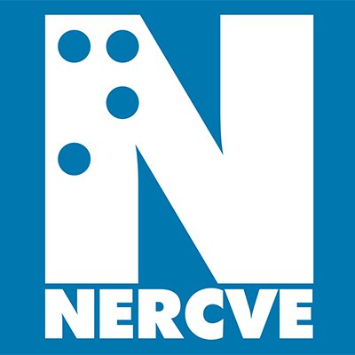
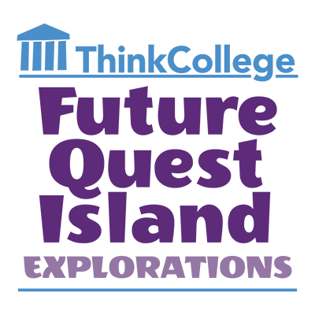

	

<h2 class="card-title"><a href="/projects/thinkcollege">
Think College</a>
</h2>

Think College develops, expands, and improves inclusive higher education options for people with intellectual and developmental disabilities.

	

<h2 class="card-title"><a href="/projects/nercve">
NERCVE</a>
</h2>

The Northeast Resource Center for Vision Education (NERCVE) trains professionals to support people with blindness and low vision in accessing education and living independently.

<h2 class="card-title"><a  href="/projects/explorevr">
ExploreVR</a>
</h2>

Explore VR offers vocational rehabilitation (VR) agencies easy and convenient access to a range of VR research, related data, and tools for planning, evaluation, and decision-making.

	

<h2 class="card-title"><a  href="/projects/employmentfirstma">
Employment First Massachusetts</a></h2>

Employment First Massachusetts promotes community-based paid employment for Massachusetts citizens with intellectual and developmental disabilities. 

	

<h2 class="card-title"><a  href="/projects/thinkwork">
ThinkWork!</a>
</h2>

ThinkWork! is the hub for an array of programs related to employment for people with intellectual and developmental disabilities.

<h2 class="card-title"><a  href="/projects/statedata">
StateData.info</a>
</h2>

StateData.info offers publications and data related to employment and disability. Users can view trends and build charts to help drive systems change.

 

	

<h2 class="card-title"><a  href="/projects/seln">
SELN</a>
</h2>

The State Employment Leadership Network (SELN) brings together state developmental disability agencies for education and guidance on employment practices and policies.

	

<h2 class="card-title"><a href="/projects/catada">CATADA</a>
</h2>

The Center for Assistive Technology Act Data Assistance (CATADA) provides technical assistance and supports to state assistive technology programs.

	

<h2 class="card-title"><a  href="/projects/fqi">
Future Quest Island</a>
</h2>

Future Quest Island is an accessible, game-based college and career readiness tool for middle schoolers. It promotes self-advocacy to help young people plan for future success.  

	

<h2 class="card-title"> <a  href="/projects/lend">
LEND Boston</a>
</h2>

 The LEND Program at Boston Children’s Hospital is an interdisciplinary training program that supports health professionals to work with patients with intellectual and developmental disabilities. 

	

	

<h2 class="card-title"><a  href="/projects/bchdsp">
Boston Children’s Hospital Down Syndrome Program</a>
</h2>

The Down Syndrome Program at Boston Children’s Hospital offers specialized services for children with Down syndrome and their families. 

	

	

<h2 class="card-title">
<a href="/projects/cle">
Community Life Engagement</a>
</h2>

Community life engagement refers to all the ways that people with intellectual and developmental disabilities participate in their communities outside of employment.

	

<h2 class="card-title">
<a  href="/projects/emp1stfl">Employment First Florida</a>
</h2>

Employment First Florida is a collaborative effort among state agencies and local organizations to increase employment outcomes for individuals with disabilities. 

	

	

<h2 class="card-title"><a href="/projects/emp1stmo">
Employment First Missouri</a>
</h2>

Employment First Missouri provides training and technical assistance to service providers throughout the state, to advance community employment for Missourians with intellectual and developmental disabilities.

	

	

		

	

	
	

	

	

	

	<h2 class="card-title"><a href="/projects/gator">
	Guardianship Alternatives and Transfer-of-Rights</a>
	</h2>
	
GATOR aims to explore the relationship between special educators’ transfer-of-rights and guardianship discussions and key predictors of transition outcomes for students with intellectual and developmental disabilities (IDD). 

	

	

	

	

	

	

	

	

	

	

	
	

	

	

	

	<h2 class="card-title"><a href="/projects/maicei">
	Massachusetts Inclusive Concurrent Enrollment Initiative</a>
	</h2>
	
The Massachusetts Inclusive Concurrent Enrollment Initiative (MAICEI) program at the University of Massachusetts Boston offers inclusive higher education opportunities to partnering school districts that support high school students with intellectual disabilities and autism, ages 18-21. 

	

	

	

	

	

	

	

		

			

			

				

			

			
			

			

			

			

			<h2 class="card-title"><a href="/projects/youthvoice">
			The Center on Youth Voice, Youth Choice</a>
			</h2>
			
The Center on Youth Voice, Youth Choice is for youth with disabilities. You have the right to make your own decisions about your life!  At the Center on Youth Voice, Youth Choice, we work with you, your families, and your supporters. We do research, advocacy, and teaching about alternatives to guardianship.

			

			

			

			

			

			

			
		
		

