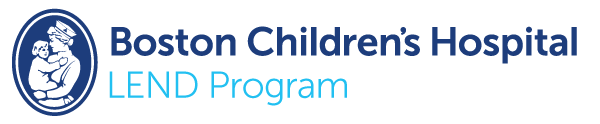

The [LEND Program at Boston Children’s Hospital](http://lendboston.org/) is an interdisciplinary training program that supports health professionals to work with patients with intellectual and developmental disabilities. Our LEND Fellows receive funding to participate in a series of seminars and courses throughout each academic year.

Course work focuses on interdisciplinary evaluations, the life course perspective and public health, cultural competence, family-centered care, and the medical home. Seminars offer an in-depth look at topics such as evidence-based research, autism spectrum disorder, and disability policy. Fellows also participate in community visits and affiliate with community-based organizations that offer services to diverse populations throughout the Boston area.

[Learn more about LEND Boston.](http://lendboston.org/)
