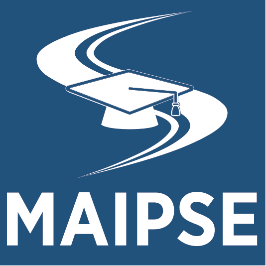
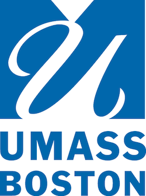

  

  
  

  

    

      The Inclusive Education Initiative at the University of Massachusetts Boston offers higher education opportunities for students through partnerships with local school districts and state agencies. The Inclusive Education Initiative is a fully inclusive, non-degree seeking, enrollment opportunity designed to support students with intellectual disabilities, autism, or other developmental disabilities to go to college. Students can increase their academic, social, and career outcomes by sharing the same experiences as their college peers.  

The state-funded [Massachusetts Inclusive Postsecondary Education] (MAIPSE) supports partnerships between local school districts, the Department of Developmental Services (DDS), the Massachusetts Rehabilitation Commision (MRC), other state agencies, and two- and four-year public colleges and universities in Massachusetts.

      

    

    

      

        <nav><strong class="d-block h6 my-2 pb-2 border-bottom grey">On This Page</strong>
            <ul style="list-style-type: none;">
        <li><a href="#apply">Apply</a></li>
        <li><a href="#coaches">For Coaches</a></li>
        <li><a href="#faqs">FAQs</a></li>
        <li><a href="#news">In the News</a></li>
        <li><a href="#leadership">Boston Consortium</a></li>
            </ul>
            </nav>
      

    
  
    

    <section id="apply">
    

      

        

          <h4>Community Partnerships 
            Application Process
            </h4>
            
We accept applications from families, DDS, MassAbility, or other agencies for students who are over the age of 22, have not received a high school diploma, and meet MAIPSE eligibility requirements. 

            
<strong>We are currently in the planning stages of developing our community partnerships enrollment pathway.</strong>

            
Sign up to learn more:
 
            
<a href="https://forms.gle/fhJ25FXBa4JEn3dg9" class="btn btn-outline-secondary" type="button">Sign Up</a>

        

      

      

        

          <h4>School District Partnerships  
            Application Process 
             </h4>
             
We accept applications from all local school districts for students who are 18-21, receiving transition services, and meet MAIPSE eligibility requirements. If you are unsure whether your school is already a partner, please contact us. 

             
<strong>Application Deadline for Fall Semester Start:</strong>
              Due February 20th 

          
<a href="/files/maicei/UMassBostonInclusiveEdInitiativeApplication.pdf" class="btn btn-outline-secondary" type="button">Download Application</a>

        

      

    

    

    

      

        

          <h4>Virtual Information Sessions </h4>
          
We encourage all interested applicants and partners to attend a virtual information session, to learn more about the Inclusive Education Initiative at UMass Boston. 

          

            <strong>Sign up for a virtual session:</strong>
          

          
No sessions are currently scheduled. Please check back for updates.

          <!--<a class="btn btn-outline-secondary" type="button" href="https://docs.google.com/forms/d/1uWOmtVdE7DP2o_egCzLphGRne6r7ttXpcysyDAP3ANo/edit?ts=61425a04">Sign Up</a>-->
        

      

      

        

          <h4>Contact Information </h4>

For questions, contact:

Rachel Estremera    
  Program Coordinator  
  Email: <a href="mailto:Rachel.Estremera@umb.edu" class="text-white">Rachel.Estremera@umb.edu</a>  
  Phone: (617) 297-6797
  

        

      

    

  </section>
    

    <section id="coaches">
      <h2>For Peer Coaches</h2>
      

        

          <h2 class="accordion-header" id="mentor-headingOne">
            <button class="accordion-button collapsed" type="button" data-bs-toggle="collapse" data-bs-target="#mentor-collapseOne" aria-expanded="false" aria-controls="mentor-collapseOne">
              Are you interested in becoming a peer coach?
            </button>
          </h2>
          

            

              
Peer coaches are current UMass Boston undergraduate and graduate students. Peer coaches support students enrolled in the Inclusive Education Initiative by promoting friendship development, exploring campus resources, encouraging involvement in clubs and activities, and providing academic support.

              
UMass Boston students can contact the Program Coordinator for more information.

              

          

        

      

    </section>
    

<section id="faqs">
<h2>FAQs</h2>

  

    <h2 class="accordion-header" id="flush-headingOne">
      <button class="accordion-button collapsed" type="button" data-bs-toggle="collapse" data-bs-target="#flush-collapseOne" aria-expanded="false" aria-controls="flush-collapseOne">
        Who is eligible for MA Inclusive Postsecondary Education?      </button>
    </h2>
    

      

MA Inclusive Postsecondary Education (MAIPSE) is open to students with severe intellectual disability, autism, or other developmental disability who want to go to college. 

      
For students attending through school district partnerships→ participation is open to students who:
        <ul>
        <li>Have a documented severe intellectual disability, autism, or other developmental disability 
        <li>are 18 to 21 years of age, have not passed the Massachusetts Comprehensive Assessment System (MCAS) exam, and are eligible for special education services documented through an Individualized Education Program (IEP); or 
        <li>are 20 to 21 years of age, have passed MCAS, but are still eligible for special education services through an IEP because of significant functional disabilities and/or transition needs.
        </ul>
        

        

        For students attending through community partnerships→ participation is open to students who:
        <ul>Have a documented intellectual or developmental disability 
        <li>Are the age of 22 or older</li>
        <li>Did not receive a high school diploma</li>
        <li>Are receiving services from DDS, MassAbility, or other state agencies, and are eligible for state funding to support enrollment.</li>
        </ul>
        

        

    

  

  

    <h2 class="accordion-header" id="flush-headingTwo">
      <button class="accordion-button collapsed" type="button" data-bs-toggle="collapse" data-bs-target="#flush-collapseTwo" aria-expanded="false" aria-controls="flush-collapseTwo">
        How can students participate in inclusive postsecondary education?
      </button>
    </h2>
    

      

        Students who are eligible for special education services and fit the disability/age requirements above, should contact their school district's transition coordinator to begin the conversation about college-based transition services. 

Students who are over the age of 22, and fit the requirements above should contact their adult agency case manager to begin a conversation about attending college.

Prospective students, families, school district staff and adult agency providers may contact us for more information regarding the application process and eligibility requirements. 

    

  

  

    <h2 class="accordion-header" id="flush-headingSix">
      <button class="accordion-button collapsed" type="button" data-bs-toggle="collapse" data-bs-target="#flush-collapseSix" aria-expanded="false" aria-controls="flush-collapseSix">
        What is the difference between the terms dual enrollment and inclusive postsecondary education?
      </button>
    </h2>
    

      

        <dl>
          <dt>Dual enrollment</dt>
          <dd>
Dual enrollment allows high school students to take college classes, either for credit or noncredit, while they are still enrolled in high school. Students use dual enrollment to engage in classes, to prepare for applying to college, with the goal to enroll as a degree-seeking student. 

            
Students who are receiving special education or transition services may utilize a dual enrollment option and receive support.
</dd>
          <dt>Inclusive postsecondary education</dt>
          <dd>
Inclusive postsecondary education provides access to college for students who would not otherwise qualify for enrollment as a degree-seeking student. Inclusive postsecondary education supports students who may be receiving high school transition services, or services from adult state disability agencies. 

            
Students who are still receiving high school transition services may or may not be working toward their high school diploma. Students who are over the age of 22 and receiving services from state agency providers have not received a high school diploma.
</dd>
        </dl>        

    

  

  

    <h2 class="accordion-header" id="flush-headingFive">
      <button class="accordion-button collapsed" type="button" data-bs-toggle="collapse" data-bs-target="#flush-collapseFive" aria-expanded="false" aria-controls="flush-collapseFive">
        How does Inclusive Postsecondary Education benefit students?
      </button>
    </h2>
    

      

Evidence shows that students benefit academically and transition to young adulthood more independently when they can engage in the array of academic, social, and career development activities alongside their peers on a college campus. 

        
Students benefit by participation in:
        <ul>
        <li>College courses that support their personal, academic, and career goals</li>
        <li>Social activities on campus, including student organizations and other extracurricular activities</li>
        <li>Campus resources, i.e. career services, disability resources, tutoring, etc..</li>
        <li>Person-centered planning </li>
        <li>On-campus internships/ paid work opportunities </li>
        <li>Independent travel and travel training</li>
        </ul>

        

    

  

  

</section>

<section id="news">
  <h2>UMass Boston MAICEI In the News!</h2>
  

      

        

          Student Spotlight
        

        

        <a href="https://thinkcollege.net/sites/default/files/files/resources/SS15_Nykenge_Blue.pdf">
          National Coordinating Center Interviews: <strong><em>Nykenge Blue</em></strong>, University of Massachusetts Boston
           </a>
      

      

    <!--  

        

          Helpful Introduction
        

        

          
        <a href="https://communityinclusion.medium.com/learn-about-the-massachusetts-inclusive-concurrent-enrollment-initiative-program-at-umass-boston-9bfd1e0c93b8">Learn about the Massachusetts Inclusive Concurrent Enrollment Initiative Program at UMass Boston!</a>
      

    
 --->
    

    <!--

  

    Article in <em>The MassMedia</em>
  

  

  <a href="http://www.umassmedia.com/news/introducing-the-umass-boston-maicei-program/article_51933ba6-4ef7-11ec-ae60-6b31e9c47305.html">Introducing the UMass Boston MAICEI program</a>

-->

</section>

<section id="leadership">
<h2>Boston Consortium for Inclusive Postsecondary Education </h2>

The Boston Inclusive Postsecondary Education Consortium planning team  includes representatives from the University of Massachusetts Boston, Massachusetts College of Art and Design, Roxbury Community College, Bunker Hill Community College, local partnering school districts, representatives from the Department of Developmental Services, Massachusetts Rehabilitation Commission, parent advisors, and community advocates. The team meets four times a year and plays a key role in the implementation and oversight of inclusive post secondary education partnerships in the greater Boston area.

</section>

Institute for Community Inclusion 
  University of Massachusetts Boston 
  100 Morrissey Blvd. 
  Boston, MA 02125 

