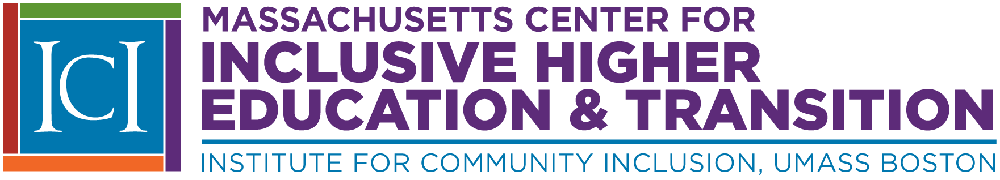

Our team at the Massachusetts Center for Inclusive Higher Education and Transition is dedicated to advancing higher education and transition opportunities for youth and young adults with intellectual disabilities (IDD) and autism. Our Center has three important goals:  

  1. Promote a fully inclusive model of services  
  1. Provide training and professional development opportunities for practitioners who work with youth and young adults with disabilities  
  1. Provide resources to youth and young adults with disabilities, their families, advocates, and service providers  

 

**Join us as we work together to create new opportunities for youth and young adults with IDD and autism!**
