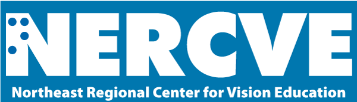

The [Northeast Resource Center for Vision Education](https://www.nercve.org/) (NERCVE) is committed to improving education for people with blindness and low vision. We offer in-person and online training in three main areas: Teacher of Students with Visual Impairments, Orientation and Mobility, and Vision Rehabilitation Therapy.

Graduates of our programs are trained to help people with visual disabilities access high-quality education, seek employment, and travel independently. Learners can access our courses and complete their master of education degree in vision studies from anywhere in the world. We are affiliated with the [Vision Studies Program](https://globalinclusion.umb.edu/academics/graduate-programs/vision-studies-med) within UMass Boston’s [School for Global Inclusion and Social Development](https://globalinclusion.umb.edu/).

[Learn more about how NERCVE trains](https://www.nercve.org/) vision professionals.
