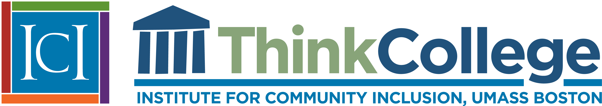

[Think College](https://thinkcollege.net) is a national initiative dedicated to developing, expanding, and improving inclusive higher education options for people with intellectual disability. With a commitment to equity and excellence, Think College supports evidence-based and student-centered research and practice by generating and sharing knowledge, guiding institutional change, informing public policy, and engaging with students, professionals, and families. Students, families, and educators can use our [College Search](https://thinkcollege.net/college-search) feature to locate a college or university that includes learners with intellectual disability. Our website also features resources for families, information around training and technical assistance, archived webinars, and news about the latest developments in the field of inclusive higher education.

Visit [ThinkCollege.net](https://thinkcollege.net) to learn more!
