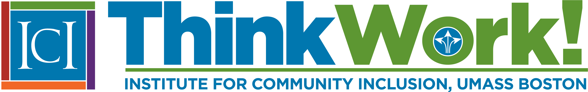

[ThinkWork!](https://www.thinkwork.org/) is the hub for an array of projects related to employment for people with intellectual and developmental disabilities (IDD). Examples include the [Rehabilitation Research & Training Center on Advancing Employment for Individuals with IDD](https://www.thinkwork.org/rrtc). This project conducts and shares research on topics such as the best ways to share information about employment with people with IDD and their families, and ways to increase the effectiveness of employment consultants.

ThinkWork! is also home to the [Community Life Engagement](https://www.thinkwork.org/cle) project, which examines the many ways that people with IDD spend their time when they are not at school or at work; and [Real Work Stories](https://www.thinkwork.org/project/real-work-stories), which shares stories of people with IDD who have found fulfilling paid employment in their communities and the agencies that supported them to reach that goal.

[Find out more about ThinkWork! and its projects.](https://www.thinkwork.org/)
