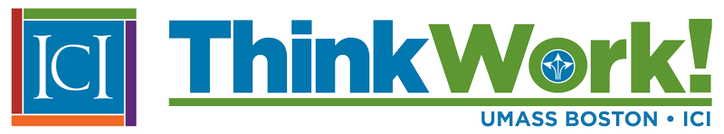

[ThinkWork!](https://www.thinkwork.org/) is the hub for an array of projects related to employment for people with intellectual and developmental disabilities (IDD). One project is the [Rehabilitation Research & Training Center on Advancing Employment for Individuals with IDD](https://www.thinkwork.org/rrtc). We conduct and publish research on how to share information about employment with people with IDD and their families, ways to increase the effectiveness of employment consultants, and other relevant topics.

ThinkWork! is also home to the [Community Life Engagement](https://www.thinkwork.org/cle) which examines the many ways that people with IDD spend their time when they are not at school or at work. ThinkWork! also includes [Real Work Stories](https://www.thinkwork.org/project/real-work-stories), highlighting people with IDD who have found fulfilling paid employment in their communities and the agencies that supported them to reach that goal..

[Find out more about ThinkWork! and its projects.](https://www.thinkwork.org/)