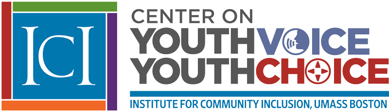

The [Center on Youth Voice, Youth Choice (CYVYC)](https://youth-voice.org/) is a national resource center on alternatives to guardianship. CYVYC supports research, training, and systems change initiatives, and emphasizes engagement with diverse and underserved communities. A strong partnership of youth with intellectual/developmental disabilities (IDD), family members, practitioners, and researchers contributes to expertise and effectiveness of the Center. It is guided by an Advisory Committee comprised of at least 75% youth and young adults with IDD.

The goals of this Center are to ensure that:

1) stakeholders have more information about alternatives to guardianship

2) an increased number of youth have more decision-making options

3) fewer students are subject to guardianship

Major activities of the Center include:

1.  Research that provides a national overview of the policies and practices related to guardianship and its alternatives
2.  Development of a national coalition of key stakeholders that endorses and shares information about alternatives to guardianship
3.  Support for multi-stakeholder teams in 11 states, that are working to increase the use of guardianship alternatives
4.  Implementation of a Youth Ambassador program that provides support, mentorship, and leadership development to up to 45 youth with IDD who will co-lead state teams, serve on the advisory board, and be a resource in their states
5.  Resource development and dissemination for a broad and culturally and linguistically diverse stakeholder group
6.  Evaluation that is ongoing and facilitates sustainability.

Visit [CYVYC](https://youth-voice.org/) to learn more!