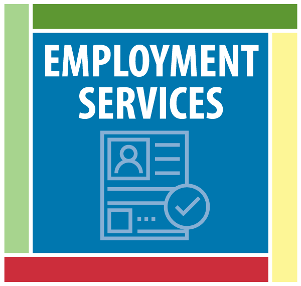
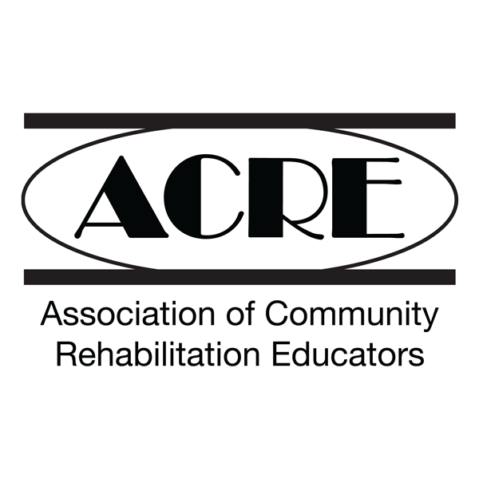

From expert consultation and technical assistance to online training for employment professionals, our services help agency leaders and disability staff to excel and thrive in their work.

<article class="card">

<h2 class="card-title">
<a href="https://ici-consulting.netlify.com/"> 
ICI Consulting</a></h2>

Our experts can help your agency or organization improve your outcomes, track your progress, and reach your goals.

</article>

<article class="card">

<h2 class="card-title"><a href="https://www.communityinclusion.org/employmentservices/"> 
ICI Employment Services</a></h2>

Every day, we support people with disabilities to find and sustain employment at fulfilling jobs in the community.

</article>

<article class="card">

<h2 class="card-title"><a href="https://www.directcourseonline.com/employment-services/"> 
College of Employment Services</a></h2>

This dynamic online suite of courses trains employment professionals to guide people with disabilities toward satisfying careers.

</article>

<article class="card">

<h2 class="card-title"><a href="https://www.communityinclusion.org/cesacre/"> 
	CES/ACRE</a></h2>

Professionals who complete courses from the College of Employment Services can receive additional instruction to gain ACRE certification. 

</article>

